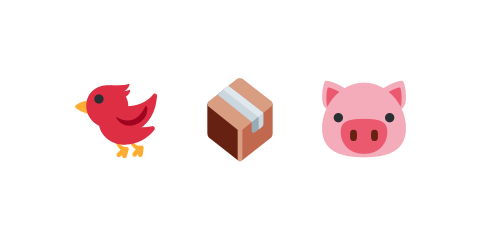

# 01 何を作るか

このハンズオンでは、**パチンコで鳥を飛ばして、箱を崩し、標的（ブタ）を全部倒す**ゲームを作ります。
いわゆる「アングリーバード」のような物理ゲームです。まずは完成版を触ってみましょう。

パチンコの鳥をドラッグして引っ張り、離すと飛びます。強く引くほど速く飛びます。箱を崩して
ブタに当てて、全部倒せばクリアです。

::preview[完成版（実際に触って動かせます）]{src="06-additional-features/04-settings-sound"}

## どうやって作っていくか

いきなり完成形を作るのは大変です。この教材では、小さな一歩に分けて、少しずつ育てていきます。
大きく分けて3つのステップで進みます。

1. **基本（白黒で作る）** … まずは丸や四角だけの白黒の画面で、物理・操作・画面の切り替えといった
   「仕組み」を作ります。見た目はあとまわしです。
2. **ゲームロジック** … 標的（ブタ）・クリア・スコアなど、ゲームの「ルール」を作ります。
3. **装飾（仕上げ）** … 画像・効果音・BGM をつけて、見た目と手ざわりを仕上げます。

「見た目より先に、仕組みとルールを作る」——これがつまずきにくい進め方です。その理由は
[05 開発の進め方](../../05-development-flow/01-no-decoration/LECTURE.md) の章でくわしく説明します。

## 使う道具

- **Phaser 3** … ゲームを作るためのライブラリ。画面表示・入力・音などをまとめて面倒みてくれます。
- **Matter.js** … 物理エンジン。重力・衝突・崩れ方を計算してくれます（Phaser に同梱されています）。

どちらも **CDN から読み込むだけ**で使えます。インストールやビルドの準備は要りません。
次の節で、コードを書くためのエディタを用意します。
