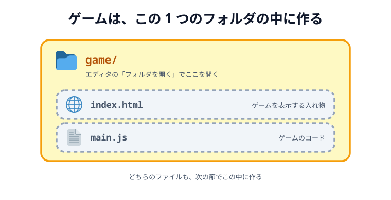

# 02 エディタを用意する


ゲームのコードを書くために、テキストエディタを用意します。おすすめは無料の
**Visual Studio Code（VS Code）** です。すでに **Cursor** や **Windsurf**、**VSCodium** を使っている人は、
そのままで大丈夫です。これらはどれも VS Code をもとに作られたエディタなので、画面も操作もほぼ同じです。

## エディタを入れる

まだ入っていなければ、公式サイトからダウンロードしてインストールします。どれか1つで構いません。

- Visual Studio Code: https://code.visualstudio.com/
- Cursor: https://cursor.com/
- Windsurf: https://windsurf.com/

このあとの説明は VS Code の画面を前提に書きますが、Cursor などでも読み替えずにそのまま進められます。

## 作業フォルダを開く

このゲームは、1つの `game/` フォルダの中に作っていきます。エディタの「フォルダを開く」から、
自分の作業フォルダを開いておきましょう。次の節で、その中に最初のファイルを作ります。



_図: 開くのは `game/` フォルダ 1 つだけ。中の 2 ファイルはまだ無く、次の章で作る。_

## Live Server を入れる（必須）

このゲームは、あとの章で画像と音を読み込みます。とくに**音**は、`index.html` をダブルクリックして
開く方法（`file://`）だと、ブラウザの安全のしくみ（CORS）にブロックされて読み込めず、鳴りません。
音を鳴らすには、**簡単な Web サーバー**を通してゲームを開く必要があります。

そのため、エディタの拡張機能 **Live Server** を必ず入れておきます。入れておくと、`index.html` を
右クリック →「Open with Live Server」でサーバー越しに開けます。次の節で、実際にブラウザで開いて確認します。

Cursor / Windsurf / VSCodium といった **VS Code 系のエディタ**でも、まったく同じ拡張機能が使えます。
違うのは「拡張機能をどこから取ってくるか（マーケットプレイス）」だけです。自分の使っているエディタの
手順を下から選んでください。

### VS Code の場合

取得先は **VS Code Marketplace** です。

- Live Server（VS Code Marketplace）: https://marketplace.visualstudio.com/items?itemName=ritwickdey.LiveServer

1. 左側のバーにある拡張機能アイコン（四角が4つ並んだマーク）をクリックします。ショートカットは `Cmd + Shift + X`（Windows は `Ctrl + Shift + X`）です。
2. 上の検索ボックスに `Live Server` と入力します。
3. 作者が `Ritwick Dey` のものを選び、**Install（インストール）** ボタンを押します。
4. 右下のバーに **Go Live** と表示されれば完了です。

### Cursor の場合

Cursor は VS Code をもとに作られたエディタなので、画面も手順もほぼ同じです。ただし取得先が
VS Code Marketplace ではなく **Open VSX** という別のマーケットプレイスになっています。Live Server は
Open VSX にも公開されているので、そのまま検索して入れられます。

- Live Server（Open VSX）: https://open-vsx.org/extension/ritwickdey/LiveServer

1. 左側のバーにある拡張機能アイコンをクリックします（`Cmd + Shift + X` / `Ctrl + Shift + X`）。
2. 検索ボックスに `Live Server` と入力します。
3. 作者が `Ritwick Dey` のものを選び、**Install** を押します。
4. 右下のバーに **Go Live** と表示されれば完了です。

似た名前の別の拡張機能が並ぶことがあります。作者が `Ritwick Dey` になっているかを必ず確かめてください。

### Windsurf / VSCodium など、その他の VS Code 系の場合

これらも Open VSX から拡張機能を取得します。手順は Cursor と同じで、拡張機能パネルから
`Live Server`（作者 `Ritwick Dey`）を検索してインストールします。

### 検索しても出てこないときは

マーケットプレイスに表示されない場合は、拡張機能のファイル（`.vsix`）を直接入れられます。

1. Open VSX の Live Server のページ https://open-vsx.org/extension/ritwickdey/LiveServer を開きます。
2. **Download** から `.vsix` ファイルを保存します。
3. エディタで拡張機能パネルを開き、右上の `...`（三点メニュー）→ **Install from VSIX...** を選びます。
4. 保存した `.vsix` を選ぶとインストールされます。

### そもそも拡張機能を入れられないときは

会社の PC などで拡張機能を入れられない場合は、ターミナルから簡易サーバーを立てても進められます。
`game/` フォルダの中で次のどちらかを実行し、表示された URL をブラウザで開いてください。

```sh
# Python が入っている場合
python3 -m http.server 8000
# → http://localhost:8000/ を開く
```

```sh
# Node.js が入っている場合
npx serve
# → 表示された http://localhost:3000 などを開く
```

止めるときはターミナルで `Ctrl + C` を押します。

### アンインストールの手順

ハンズオンが終わって不要になったら、次の手順で消せます。VS Code でも Cursor でも同じです。
ゲームのファイルは消えません。

1. 左側のバーの拡張機能アイコンをクリックします。
2. 検索ボックスに `Live Server` と入力するか、「インストール済み（Installed）」の一覧から探します。
3. `Live Server` の歯車アイコン（または右クリック）→ **Uninstall（アンインストール）** を選びます。
4. 「Restart Extensions（拡張機能の再読み込み）」が出たら押します。これで削除完了です。

## コードを自動で整える（フォーマッター）

コードは、インデント（行頭の字下げ）がそろっていないと、かっこがどこで閉じているのかが読めなくなります。
この先は `{` と `}` が何重にも入れ子になったコードを書いていくので、**保存するたびに自動で整形される**
ようにしておくと、写し間違いにも気づきやすくなります。

VS Code には HTML・CSS・JavaScript を整形するしくみが**最初から入っています**。Live Server と違って、
拡張機能を入れる必要はありません。設定を1つオンにするだけです。

- フォーマット（VS Code 公式ドキュメント）: https://code.visualstudio.com/docs/editing/codebasics#_formatting
- 設定（VS Code 公式ドキュメント）: https://code.visualstudio.com/docs/configure/settings

### 保存したときに自動で整形する

1. 設定画面を開きます。ショートカットは `Cmd + ,`（Windows は `Ctrl + ,`）です。メニューからなら Mac は **Code → Settings → Settings**、Windows は **File → Preferences → Settings** です。
2. 画面上部の検索ボックスに `format on save` と入力します。
3. **Editor: Format On Save** という項目が出てくるので、チェックボックスをオンにします。
4. 設定は自動で保存されます。タブはそのまま閉じて構いません。

これで、`Cmd + S`（Windows は `Ctrl + S`）で保存するたびに、インデントや空白が自動でそろいます。

検索ボックスの下には **ユーザー（User）** と **ワークスペース（Workspace）** の2つのタブがあります。
**ユーザー**のまま設定すると、これから開くすべてのフォルダで効きます。このハンズオンの `game/` フォルダ
だけに効かせたいときは、**ワークスペース**タブに切り替えてからチェックを入れてください。

### 使うフォーマッターを確かめる

同じ設定画面で `default formatter` と検索すると **Editor: Default Formatter** が出てきます。
`null`（未設定）のままなら、VS Code に組み込みの整形機能が使われます。このハンズオンではそれで十分なので、
変更しなくて構いません。

Prettier などの整形用の拡張機能をすでに入れている場合は、保存時に
「複数のフォーマッタがあります（There are multiple formatters...）」というメッセージが出ることがあります。
そのときは **Configure（構成）** を押して、使うものを1つ選んでください。どれを選んでも、このゲームの
コードは問題なく動きます。

### 設定ファイルに直接書く場合

設定画面での操作は、`settings.json` というファイルに記録されています。自分で書きたい人は、設定画面の
右上にある **Open Settings (JSON)** のアイコンからこのファイルを開いて、次の行を足しても同じです。

```json
{
  "editor.formatOnSave": true
}
```

`game/` フォルダの中だけで有効にしたいときは、`game/.vscode/settings.json` というファイルを作り、
同じ内容を書きます。

### 好きなタイミングで整形する

保存とは関係なく、いま開いているファイルを整形したいときは次のどちらかです。

- ショートカット: `Shift + Option + F`（Windows は `Shift + Alt + F`、Linux は `Ctrl + Shift + I`）
- エディタの中で右クリック → **Format Document（ドキュメントのフォーマット）**

### うまく整形されないときは

- **保存しても何も変わらない** … すでに整っているだけかもしれません。わざとインデントを崩してから保存して、元に戻るか試してみてください。
- **右下のステータスバーを見る** … `HTML` や `JavaScript` と表示されていれば、その言語として整形されます。`Plain Text` になっているときは、ファイル名の拡張子（`.html` / `.js`）が正しいか確かめてください。
- **Cursor / Windsurf でも同じ** … 設定画面のつくりは VS Code とまったく同じです。`format on save` で検索してチェックを入れてください。

フォーマッターはコードの見た目を整えるだけで、ゲームの動きは変わりません。うまく設定できなくても、
そのまま先に進んで大丈夫です。
