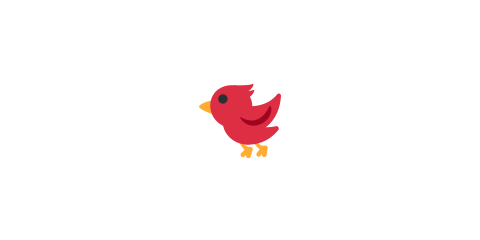

# 01 鳥を表示する



いよいよゲームを作り始めます。この節では `game/` フォルダを作り、画面に鳥（丸）を1つ表示します。
以降のすべての節は、この同じ `game/` を少しずつ書き換えて育てていきます。

> **今回さわる `game/`:** `index.html` と `main.js` を新規作成

## ファイルを2つ用意する

`game/` フォルダを作り、その中に `index.html` と `main.js` を置きます。

```text
game/
├── index.html
└── main.js
```

`index.html` は、Phaser 本体（CDN）と、自分で書く `main.js` を読み込むだけの入れ物です。

```html
<!doctype html>
<html lang="ja">
  <head>
    <meta charset="utf-8" />
    <meta name="viewport" content="width=device-width, initial-scale=1" />
    <title>01 鳥を表示する</title>
    <style>
      body {
        margin: 0;
        overflow: hidden;
        display: grid;
        place-items: center;
        min-height: 100vh;
        background: #222;
      }
      canvas {
        display: block;
      }
    </style>
    <script src="https://cdnjs.cloudflare.com/ajax/libs/phaser/3.90.0/phaser.min.js"></script>
    <script src="main.js" defer></script>
  </head>
  <body></body>
</html>
```

- `<script src="https://cdnjs.cloudflare.com/...phaser.min.js">` … Phaser 本体を CDN から読み込みます。インストールは不要です。
- `<script src="main.js" defer>` … 自分で書くゲームのコードです。`defer` は「Phaser の読み込みが終わってから実行する」ための指定です。
- `<style>` … 画面の中央にゲームを置き、まわりを暗くするだけの飾りです。

## ゲームを起動して鳥を描く

`main.js` に、ゲーム画面を作って鳥を1つ描くコードを書きます。

```js
new Phaser.Game({
  type: Phaser.AUTO,
  width: 800,
  height: 480,
  backgroundColor: '#fdf6e3',
  scene: {
    create: function () {
      // パチンコに構える鳥。白い丸に濃い輪郭線をつけて見やすくする。
      const bird = this.add.circle(140, 340, 18, 0xffffff);
      bird.setStrokeStyle(3, 0x333333);
    },
  },
});
```

- `new Phaser.Game({ ... })` … ゲームを1つ起動します。中の設定で画面の大きさや色を決めます。
- `type: Phaser.AUTO` … 描画方法（WebGL か Canvas）を Phaser におまかせします。
- `width: 800, height: 480` … 画面の横幅と高さ。横長にして、左でパチンコ・右に標的を置けるようにします。
- `backgroundColor: '#fdf6e3'` … 背景の色（うすいクリーム色）です。
- `scene` の `create` … 画面ができたとき最初に1回呼ばれる場所です。ここに「何を置くか」を書きます。
- `this.add.circle(140, 340, 18, 0xffffff)` … 位置 (140, 340) に半径 18 の白い丸を置きます。これが鳥です。
- `bird.setStrokeStyle(3, 0x333333)` … 丸のふちに太さ 3 の濃い線をつけて、背景から見やすくします。

## 動かす

`index.html` をブラウザで開くと、クリーム色の画面の左下に、輪郭のついた白い丸（鳥）が1つ表示されます。
まだ動きません。次の節で重力をかけて、落ちるようにします。

::preview[このステップの完成イメージ（実際に触って動かせます）]

::checkpoint{open="main.js"}
