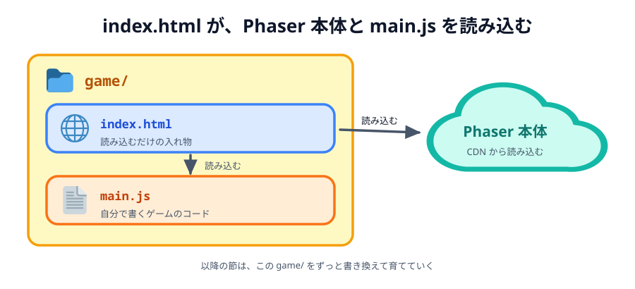
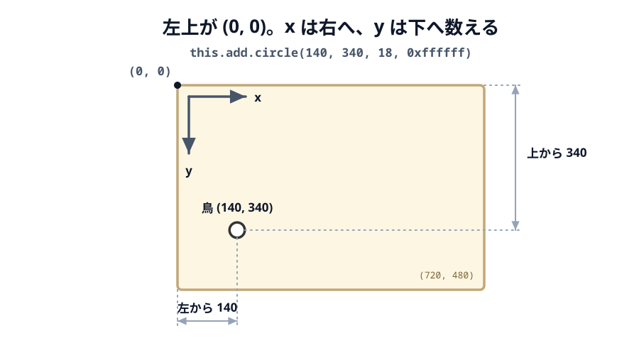
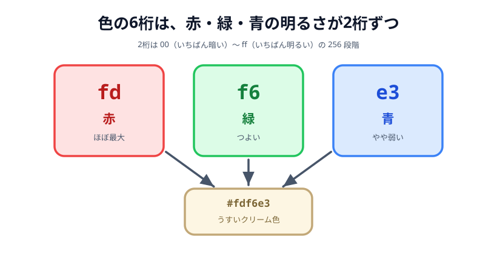
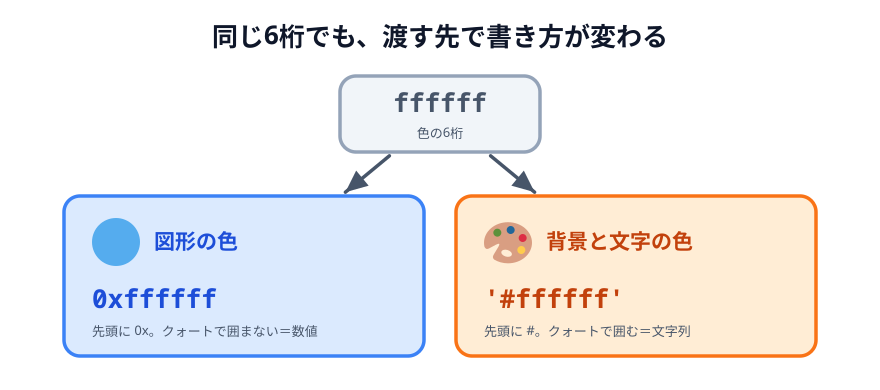
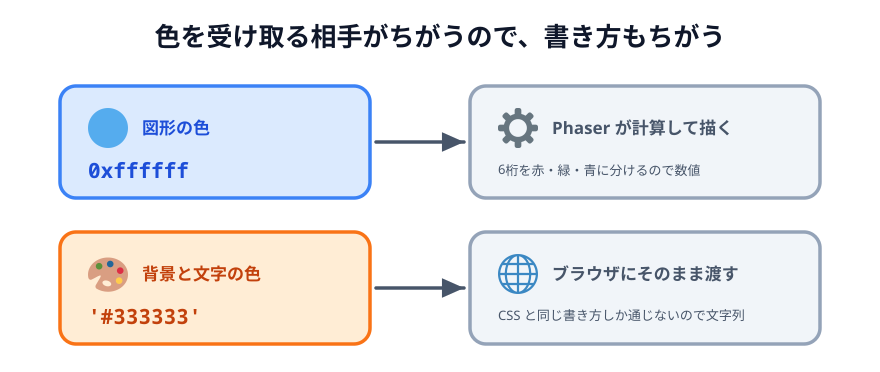

# 01 鳥を表示する


いよいよゲームを作り始めます。この節では `game/` フォルダを作り、画面に鳥（丸）を1つ表示します。
以降のすべての節は、この同じ `game/` を少しずつ書き換えて育てていきます。

> **今回さわる `game/`:** `index.html` と `main.js` を新規作成

## ファイルを2つ用意する

`game/` フォルダを作り、その中に `index.html` と `main.js` を置きます。



_図: `game/` に置くのはこの 2 つだけ。`index.html` は読み込むだけの入れ物で、ゲームの中身は `main.js` に書く。_

`index.html` は、Phaser 本体（CDN）と、自分で書く `main.js` を読み込むだけの入れ物です。

:::code[ファイル全体（新規作成）]{filepath=index.html offset=1}

```html
<!doctype html>
<html lang="ja">
  <head>
    <meta charset="utf-8" />
    <meta name="viewport" content="width=device-width, initial-scale=1" />
    <title>01 鳥を表示する</title>
    <style>
      body {
        margin: 0;
        overflow: hidden;
        display: grid;
        place-items: center;
        min-height: 100vh;
        background: #222;
      }
      canvas {
        display: block;
      }
    </style>
    <script src="https://cdnjs.cloudflare.com/ajax/libs/phaser/3.90.0/phaser.min.js"></script>
    <script src="main.js" defer></script>
  </head>
  <body></body>
</html>
```

:::

- `<script src="https://cdnjs.cloudflare.com/...phaser.min.js">` … Phaser 本体を CDN から読み込みます。インストールは不要です。
- `<script src="main.js" defer>` … 自分で書くゲームのコードです。`defer` は「Phaser の読み込みが終わってから実行する」ための指定です。
- `<style>` … 画面の中央にゲームを置き、まわりを暗くするだけの飾りです。

## ゲームを起動して鳥を描く

`main.js` に、ゲーム画面を作って鳥を1つ描くコードを書きます。

:::code[ファイル全体（新規作成）]{filepath=main.js offset=1}

```js
new Phaser.Game({
  type: Phaser.AUTO,
  width: 720,
  height: 480,
  backgroundColor: '#fdf6e3',
  scene: {
    create: function () {
      const bird = this.add.circle(140, 340, 18, 0xffffff);
      bird.setStrokeStyle(3, 0x333333);
    },
  },
});
```

:::

- `new Phaser.Game({ ... })` … ゲームを1つ起動します。中の設定で画面の大きさや色を決めます。
- `type: Phaser.AUTO` … 描画方法（WebGL か Canvas）を Phaser におまかせします。
- `width: 720, height: 480` … 画面の横幅と高さ。横長にして、左でパチンコ・右に標的を置けるようにします。
- `backgroundColor: '#fdf6e3'` … 背景の色（うすいクリーム色）です。
- `scene` の `create` … 画面ができたとき最初に1回呼ばれる場所です。ここに「何を置くか」を書きます。
- `this.add.circle(140, 340, 18, 0xffffff)` … 位置 (140, 340) に半径 18 の白い丸を置きます。これが鳥です。
- `bird.setStrokeStyle(3, 0x333333)` … 丸のふちに太さ 3 の濃い線をつけて、背景から見やすくします。

位置の `140` と `340` は、画面の**左上から**数えた数字です。どこを指しているのか、
画面全体で見ておきます。



_図: `y` は下に向かって増える。`340` は「上から 340」なので、画面の下のほうになる。_

## 色の書き方を覚える

いまのコードには色の指定が3つ出てきました。`backgroundColor: '#fdf6e3'`、
`this.add.circle(..., 0xffffff)`、`setStrokeStyle(3, 0x333333)` です。
`'#fdf6e3'` と `0xffffff` は見た目がずいぶん違いますが、どちらも同じ「6桁の色」を指しています。
これから何度も出てくるので、ここで整理しておきます。

### 6桁は、赤・緑・青の明るさ

色は `fdf6e3` のように **6桁**で書きます。これを2桁ずつ3つに区切ると、
それぞれ**赤・緑・青**の明るさになります。



_図: `fdf6e3` は赤と緑が強く、青が少しだけ弱い。だからうすいクリーム色になる。_

2桁の部分は **16進数**です。ふだん使う数字は `0`〜`9` の10種類ですが、16進数はそこに
`a b c d e f` を足した16種類を使います（`a` が 10、`f` が 15）。2桁あるので
`00`（いちばん暗い）から `ff`（いちばん明るい）まで、256 段階の明るさを表せます。

- `ffffff` … 赤も緑も青も全開 → **白**
- `000000` … 3つとも真っ暗 → **黒**
- `333333` … 3つとも同じ値 → **グレー**（赤・緑・青が同じ値だと必ず灰色になります。`33` は暗めなので濃いグレー）
- `fdf6e3` … 赤と緑が強く、青がやや弱い → **うすいクリーム色**

色を変えたいときは、この6桁をいじります。「もう少し暗くしたい」なら3つとも小さく、
「赤っぽくしたい」なら最初の2桁を大きくする、という要領です。

### `0x` を付けるか、`'#'` を付けるか

やっかいなのは、**同じ6桁でも、渡す先によって前後の付け方が変わる**ことです。



_図: 6桁の部分は同じ。図形に渡すときは `0x` を付けた数値、背景と文字に渡すときは `'#'` を付けた文字列にする。_

- **`0xffffff`（数値）** … 先頭に `0x` を付けて、クォートでは囲みません。`0x` は JavaScript に
  「このあとの数字は16進数だよ」と伝えるための印で、全体としては**数値**として扱われます。
  `this.add.circle()` や `setStrokeStyle()` のように、Phaser の図形に色を渡すところはこの形です。
- **`'#ffffff'`（文字列）** … 先頭に `#` を付けて、全体をクォート `' '` で囲みます。
  CSS で色を書くときとまったく同じ形で、こちらは**文字列**です。`backgroundColor` や、
  あとの節で出てくる文字の色（`color: '#333333'`）はこの形です。

### なぜ2種類あるのか

わざわざ書き分けるのは、**渡したあとにその色を使う相手が、そもそもちがう**からです。



_図: 同じ「色」でも、届く先が Phaser 自身かブラウザかで、受け取れる形が変わる。_

- **図形の色は、Phaser 自身が使います。** 丸や四角を描くたびに、Phaser は6桁を
  「赤はいくつ・緑はいくつ・青はいくつ」と分解して、画面に塗る色を組み立てています。
  この分解は数値どうしの計算なので、色も数値でなければいけません。`'#ffffff'` のような
  文字列を渡すと計算が成り立たず、赤も緑も青も 0 とみなされて**真っ黒**になってしまいます。
- **文字の色は、ブラウザが使います。** Phaser は文字を描くとき、ブラウザにもとから備わっている
  文字描画の機能を呼び出して、色の指定をそのまま横流ししています。ブラウザが知っている色の
  書き方は CSS の書き方だけなので、ここには `'#333333'` のような文字列が必要になります。

「Phaser が計算に使う色」なのか「ブラウザにそのまま渡す色」なのか。
この違いが、そのまま数値と文字列の違いになっています。

> **背景色は、じつはどちらでも動きます。** `backgroundColor` は起動時に一度読まれるだけなので、
> Phaser が数値と文字列の両方を受け取れるように作ってあります（`backgroundColor: 0xfdf6e3`
> と書いても同じ色になります）。ただ `index.html` の CSS に書く背景色とすぐ隣に並ぶ設定なので、
> このレクチャーでは CSS と同じ `'#...'` に揃えています。

**図形は `0x` の数値、背景と文字は `'#'` の文字列**、と覚えておけば大丈夫です。
迷ったら「CSS にも書けそうな設定か？」で見分けられます。`backgroundColor` や `color` は
CSS でもおなじみの名前なので `'#...'`、`circle()` や `setStrokeStyle()` は Phaser の図形なので `0x...` です。

## 動かす

`index.html` をブラウザで開くと、クリーム色の画面の左下に、輪郭のついた白い丸（鳥）が1つ表示されます。
まだ動きません。次の節で重力をかけて、落ちるようにします。

::preview[このステップの完成イメージ（実際に触って動かせます）]

::codeview{defaultFile="main.js"}
