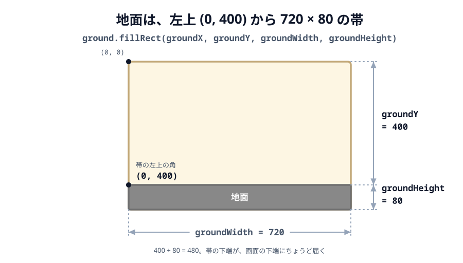

# 03 地面で受け止める


前の [02 鳥に重力を与える](../02-gravity/LECTURE.md) では、鳥が落ちて画面の外へ消えてしまいました。
この節では画面の下に「地面」を作り、鳥を受け止めます。

> **今回さわる `game/`:** `main.js` を書き換え

## 地面を描く

画面の下いっぱいに横長の帯（地面）を描きます。前の節の鳥とまったく同じで、まず**絵を置く**ところから
始めます。鳥が `this.add.circle(...)` だったところが、四角なので `this.add.rectangle(...)` になるだけです。

:::code[`create` の中（いちばん最初）]{filepath=main.js offset=12}

```js
const groundX = 360;
const groundY = 440;
const groundWidth = 720;
const groundHeight = 80;
const groundTop = groundY - groundHeight / 2; // 地面の上面。物はこの高さに乗る

const ground = this.add.rectangle(
  groundX,
  groundY,
  groundWidth,
  groundHeight,
  0x888888,
);
```

:::

`this.add.rectangle(x, y, 幅, 高さ, 色)` の `x` / `y` は、四角の**中心**です。鳥のときの
`this.add.circle(140, 80, ...)` が円の中心だったのと同じで、Phaser の図形は中心で置きます。



_図: 中心 (360, 440) から上下に 40 ずつ。上面の 400 が `groundTop`、下端はちょうど画面の下端 480。_

- `groundX` / `groundY` … 帯の**中心**。画面幅 720 の半分で 360、画面の下に寄せて 440 です。
- `groundWidth` / `groundHeight` … 帯の幅と高さ。画面の幅いっぱいの 720 と、80 です。
- `groundTop` … 帯の**上面**。中心から高さの半分だけ上なので `440 - 40` で 400 になります。
  地面の上に物を乗せるときの基準で、次の節から使います。
- `0x888888` … 塗る色（グレー）です。

## 地面に体を結びつける

いまのままでは、地面はただの絵です。鳥はすり抜けてしまいます。前の節で鳥にやったのと同じように、
`gameObject` で**体**（当たり判定）を結びつけます。

:::code[`create` の中（いま書いた地面を描くコードの続き）]{filepath=main.js offset=26}

```js
this.matter.add.gameObject(ground, { isStatic: true });
```

:::

- `this.matter.add.gameObject(絵, 設定)` … 絵に体を結びつけます。四角い絵なら、その大きさの
  四角い体ができます。
- `isStatic: true` … 「動かない」印です。重力を受けず、ぶつかられても押されず、その場に固定されます。

鳥に書いたのは `this.matter.add.gameObject(bird, { shape: ..., restitution: 0.2 })` でした。
**同じ命令で、渡す設定が違うだけ**です。地面と鳥の違いは、つきつめると `isStatic: true` の 1 行に
集約されます。

## 鳥を落として受け止める

鳥は前の節と同じく上から落とします。`restitution`（跳ね返り）を少し足しておきます。

:::code[`create` の中（地面に体を結びつけたコードの続き）]{filepath=main.js offset=28}

```js
const birdRadius = 18;

const bird = this.add.circle(140, 80, birdRadius, 0xffffff);
bird.setStrokeStyle(3, 0x333333);

this.matter.add.gameObject(bird, {
  shape: {
    type: 'circle',
    radius: birdRadius,
  },
  restitution: 0.2,
});
```

:::

- `restitution: 0.2` … ぶつかったときの跳ね返りの強さ。0 で跳ねず、1 に近いほどよく跳ねます。

## 絵と体 — この教材で物を置くときの型

地面も鳥も、同じ 2 手で置きました。この 2 手が、以降ずっと出てくる型です。

1. `this.add.○○(...)` で**絵**を置く（`circle` / `rectangle` / あとで `image`）
2. `this.matter.add.gameObject(絵, 設定)` で**体**を結びつける

前の節で見たとおり、絵（Phaser のオブジェクト）と体（Matter の body）は別ものでした。
1 だけだと「見えるけどすり抜ける」、2 まで書いて初めて「見えて、ぶつかる」になります。

`gameObject` の仕事は「**Matter が計算した体の位置を、毎フレーム絵に移す**」ことです。
地面は `isStatic: true` なので位置が変わらず、結果として絵も動きません。動かないものも動くものも
同じ書き方でよく、動くかどうかは設定で決まります。

### うまくいかないとき

- **四角は見えるのに、鳥がすり抜ける** … `this.matter.add.gameObject(...)` を書き忘れています。
  絵だけの状態です。
- **地面が鳥に押されて落ちていく** … `isStatic: true` が抜けています。体はあるけれど、ただの
  重い板として扱われています。
- **地面が思った場所にない** … `groundX` / `groundY` は**中心**です。「上から 400 のところに
  上面を置きたい」なら、中心は `400 + 40` で 440 になります。

## 動かす

ブラウザで開くと、鳥が落ちて地面の上で止まります。少しだけ跳ねてから落ち着きます。
次の節から、この鳥を飛ばす仕組みを作っていきます。

::preview[このステップの完成イメージ（実際に触って動かせます）]

::codeview{defaultFile="main.js"}
