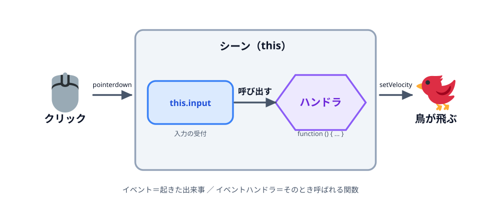

# 04 クリックで飛ばす


前の [03 地面で受け止める](../03-ground/LECTURE.md) で、鳥が地面の上に乗るようになりました。
この節では、クリックすると鳥に勢いをつけて飛ばします。まずは「決まった速さ・決まった向き」で
飛ばし、次の節でパチンコらしく「引っ張った分だけ飛ぶ」ように発展させます。

> **今回さわる `game/`:** `main.js` を書き換え

## 鳥をパチンコの位置に置く

落ちてくる代わりに、鳥を最初から地面の上（パチンコの位置）に置いておきます。

```js
      const radius = 18;

      // 鳥は地面の上（パチンコの位置）に置いておく。
      const bird = this.add.circle(140, groundY - radius, radius, 0xffffff);
      bird.setStrokeStyle(3, 0x333333);

      this.matter.add.gameObject(bird, {
        shape: {
          type: 'circle',
          radius: radius,
        },
        restitution: 0.2,
      });
```

- `groundY - radius` … 鳥の中心を地面のちょうど上にのせるための高さです。半径のぶんだけ持ち上げています。

## クリックで勢いをつける

画面をクリックしたときに、鳥へ速度を与えて飛ばします。

```js
      // クリックしたら、右上に向かって初速を与えて飛ばす。
      this.input.on('pointerdown', function () {
        bird.setVelocity(12, -12);
      });
```

- `this.input.on('pointerdown', ...)` … 画面が押された（クリック／タップされた）ときに中の処理を実行します。
- `bird.setVelocity(12, -12)` … 鳥の速度を「横 +12（右へ）・縦 −12（上へ）」に設定します。
  Y はプラスが下向きなので、マイナスで上向きになります。結果として右上へ飛び出します。

## `this.input.on('pointerdown', function () { ... })` を分解する

この 1 行は短いですが、これまでの `add.circle(...)` のような「今すぐ実行する命令」とは
性質が違います。**「あとで◯◯が起きたら、この処理を実行してね」と予約している**のです。



*図: イベント（起きた出来事）とイベントハンドラ（そのとき呼ばれる関数）の関係*

### `this` はシーンのこと

`create` の中の `this` は、**今作っているシーン（画面）そのもの**を指します。
`this.add.circle(...)` は「このシーンに円を追加して」、`this.matter.add.gameObject(...)` は
「このシーンの物理世界に登録して」でした。同じように `this.input` は
**このシーンの入力（マウス・タップ・キーボード）の受付係**です。

つまり `this.input.on(...)` は「このシーンの入力受付係に、お願いを登録する」という意味になります。

### イベントとイベントハンドラ

- **イベント** … 「クリックされた」「キーが押された」のように、**起きた出来事**そのもの。
  ここでは `'pointerdown'`（＝押された）という名前のイベントです。
- **イベントハンドラ** … そのイベントが起きたときに**呼ばれる関数**。
  ここでは `function () { bird.setVelocity(12, -12); }` の部分です。
- **`.on(イベント名, ハンドラ)`** … 「このイベントが起きたら、この関数を呼んでください」という**登録**。
  `on` を書いた瞬間には何も起きません。登録するだけです。

いつクリックされるかはプログラムには分かりません。だから「クリックされたら実行する処理」を
先に渡しておき、実際に起きたタイミングで Phaser 側から呼び出してもらいます。
この「出来事が起きるまで待って、起きたら呼ばれる」書き方は Web 開発全体でよく出てくる形です。

```js
this.input.on('pointerdown', function () {
  //  ^^^^^      ^^^^^^^^^^^  ^^^^^^^^^^^^
  //  受付係     イベント名    イベントハンドラ（起きたときに呼ばれる関数）
  bird.setVelocity(12, -12);
});
```

イベント名を変えれば、別の出来事も同じ形で拾えます（例: `'pointerup'` は指を離したとき）。
次の節では、この `pointerdown` と `pointerup` の 2 つを組み合わせて「引っ張って離す」操作を作ります。

## 動かす

ブラウザで開いてクリックすると、鳥が右上へ飛び、放物線を描いて地面に落ちます。
ただし今は毎回同じ飛び方です。次の節で、引っ張った向きと強さで飛び方が変わる「パチンコ」にします。

::preview[このステップの完成イメージ（実際に触って動かせます）]

::checkpoint{open="main.js"}
