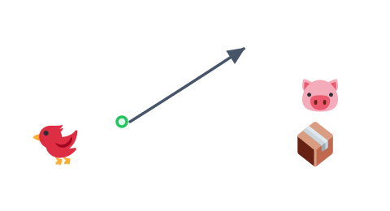
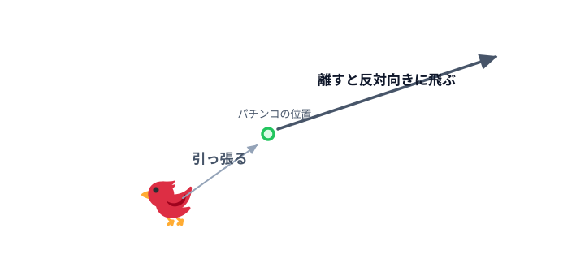

# 05 パチンコで引っ張って飛ばす



前の [04 クリックで飛ばす](../04-launch/LECTURE.md) では、クリックすると決まった速さで
鳥が飛びました。でも本物のパチンコは「**引っ張った向きと強さ**」で飛び方が変わります。
この節では、鳥をドラッグして引っ張り、離すと引いた方向と反対に飛ぶようにします。

> **今回さわる `game/`:** `main.js` を書き換え

## パチンコの位置を決める

まず、鳥が構える「パチンコの位置（基点）」を決めます。離したときは、この位置を基点に
飛んでいきます。目印として薄い丸も置いておきます。

```js
      // パチンコの位置（ここに鳥が構え、離すとここを基点に飛ぶ）。
      const anchor = { x: 140, y: 300 };
      const maxStretch = 90; // 引っ張れる最大の長さ
      const power = 0.22; // 引っ張った長さを速さに変える倍率

      // パチンコの位置を薄い丸で示しておく。
      this.add.circle(anchor.x, anchor.y, 6, 0xbbbbbb);
```

- `anchor` … パチンコの位置。鳥はここに戻ってきて、ここを基点に飛びます。
- `maxStretch` … 引っ張れる長さの上限。これ以上は引っ張れないようにして、飛びすぎを防ぎます。
- `power` … 引っ張った長さ（ピクセル）を速さに変えるときの倍率。大きいほど強く飛びます。

## 鳥を「待機」させる

鳥を `anchor` の位置に作り、**引っ張っている間は落ちてほしくない**ので、いったん静的
（動かない状態）にしておきます。

```js
      const radius = 18;
      const bird = this.add.circle(anchor.x, anchor.y, radius, 0xffffff);
      bird.setStrokeStyle(3, 0x333333);

      this.matter.add.gameObject(bird, {
        shape: { type: 'circle', radius: radius },
        restitution: 0.2,
      });

      // 待機中は動かないように静的にしておく。
      bird.setStatic(true);
```

- `setStatic(true)` … 物理の体を「動かない」状態にします。重力で落ちなくなり、引っ張る間もその場に
  とどまります。離すときに `setStatic(false)` へ戻して、また物理で動くようにします。

## 引っ張る

マウス（指）の動きを3つのタイミングで受け取ります。**押した**・**動かした**・**離した**、の3つです。
まず「押した」と「動かした」を書きます。

```js
      let dragging = false;

      // 押した瞬間：鳥をパチンコの位置に戻して、引っ張り開始。
      this.input.on('pointerdown', function () {
        bird.setStatic(true);
        bird.setPosition(anchor.x, anchor.y);
        bird.setVelocity(0, 0);
        dragging = true;
      });

      // 動かしている間：パチンコの位置から一定の長さまでで鳥を引っ張る。
      this.input.on('pointermove', function (pointer) {
        if (!dragging) return;

        const dx = pointer.x - anchor.x;
        const dy = pointer.y - anchor.y;
        const dist = Math.hypot(dx, dy);

        if (dist > maxStretch) {
          const scale = maxStretch / dist;
          bird.setPosition(anchor.x + dx * scale, anchor.y + dy * scale);
        } else {
          bird.setPosition(pointer.x, pointer.y);
        }
      });
```

- `dragging` … いま引っ張っている最中かどうかを覚えておく印です。
- `pointerdown` … 押した瞬間。鳥をパチンコの位置に戻し、速度を 0 にして、引っ張りを開始します。
- `pointermove` … 動かしている間だけ（`dragging` が `true` のとき）反応します。
- `dx` / `dy` / `dist` … パチンコの位置から指までの、横のずれ・縦のずれ・まっすぐな距離です。
- `if (dist > maxStretch)` … 引っ張りすぎたときは、向きはそのままで長さだけ `maxStretch` にそろえます
  （`scale` で縮めています）。上限内ならそのまま指の位置に鳥を置きます。

## 離して飛ばす

離した瞬間に、**引っ張った向きと反対**へ、引いた長さに応じた速さで飛ばします。

```js
      // 離した瞬間：引っ張った向きと反対に、長さに応じた速さで飛ばす。
      this.input.on('pointerup', function () {
        if (!dragging) return;
        dragging = false;

        const vx = (anchor.x - bird.x) * power;
        const vy = (anchor.y - bird.y) * power;

        bird.setStatic(false);
        bird.setVelocity(vx, vy);
      });
```

- `(anchor.x - bird.x)` … 「パチンコの位置 − いまの鳥の位置」なので、引っ張った向きと**反対**の向きになります。
  これに `power` を掛けて速さにします。
- `setStatic(false)` … 静的をやめて、また物理で動くようにします。
- `setVelocity(vx, vy)` … その速さで飛び出します。



*図: パチンコの位置から引いたベクトル（`bird → anchor`）と反対向きに、長さに比例した速さで発射する。*

## 動かす

ブラウザで開くと、鳥をドラッグして引っ張れます。離すと、引いた向きと反対にビュンと飛びます。
強く引くほど速く飛びます。まだ狙いの線がないので、次の節で引っ張り中に飛ぶ方向の線を出します。

::preview[このステップの完成イメージ（実際に触って動かせます）]

::checkpoint{open="main.js"}
