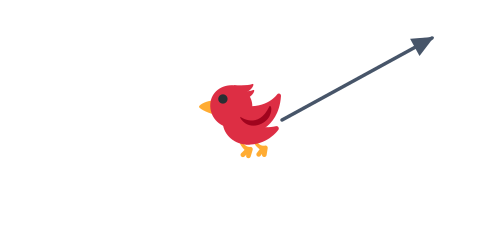

# 06 狙いの線を表示する



前の [05 パチンコで引っ張って飛ばす](../05-slingshot/LECTURE.md) で、引っ張って飛ばせるように
なりました。でも、どっちへ飛ぶのか分かりにくいです。この節では、引っ張っている間に「飛ぶ方向の線」を
表示します。

> **今回さわる `game/`:** `main.js` を書き換え

## 線を描く道具を用意する

狙いの線を描くための専用の「お絵かき道具」を1つ用意します。毎フレーム描き直すので、変数に持っておきます。

```js
      // 狙いの線を描くための専用グラフィックス（毎フレーム描き直す）。
      const aim = this.add.graphics();
```

## 引っ張っている間に線を引く

`pointermove` の中（鳥を引っ張る処理の後）に、狙いの線を描くコードを足します。

```js
        // 狙いの線を引き直す。鳥からパチンコの位置を通り、その先（飛ぶ方向）へ伸ばす。
        const forwardX = anchor.x + (anchor.x - bird.x) * 1.5;
        const forwardY = anchor.y + (anchor.y - bird.y) * 1.5;
        aim.clear();
        aim.lineStyle(2, 0x333333, 0.5);
        aim.lineBetween(bird.x, bird.y, forwardX, forwardY);
```

- `forwardX` / `forwardY` … パチンコの位置から「引っ張った向きと反対（＝飛ぶ向き）」へ、少し先の点を計算します。
- `aim.clear()` … 前のフレームで引いた線を消します。これをしないと線が残り続けてしまいます。
- `aim.lineStyle(2, 0x333333, 0.5)` … 線の太さ 2・色（濃いグレー）・濃さ 0.5（半透明）を決めます。
- `aim.lineBetween(...)` … 鳥の位置から `forward` の点まで、まっすぐな線を引きます。

## 離したら線を消す

`pointerup`（離したとき）に、狙いの線を消します。

```js
        // 発射したら狙いの線は消す。
        aim.clear();
```

## 動かす

引っ張っている間、鳥から飛ぶ方向へ線が伸びます。離すと線が消えて、その向きへ飛びます。
狙いがつけやすくなりました。次の節で、飛ばす相手（崩せる箱）を用意します。

::preview[このステップの完成イメージ（実際に触って動かせます）]

::checkpoint{open="main.js"}
