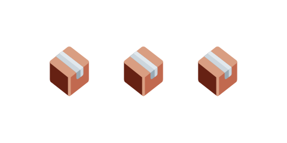

# 07 箱を積んで崩す



前の [06 狙いの線を表示する](../06-aim-line/LECTURE.md) までで、狙って飛ばせるようになりました。
この節では、右側に箱を積みます。箱は物理で動くので、鳥をぶつけると崩れます。

> **今回さわる `game/`:** `main.js` を書き換え

## 箱を積む

`create` の中（地面を作った後）に、箱を縦に3つ積むコードを足します。

```js
      // 右側に箱を積む。動く物理ボディなので、鳥が当たると崩れる。
      const boxSize = 40;
      const towerX = 620;
      for (let i = 0; i < 3; i++) {
        const boxY = groundY - boxSize / 2 - i * boxSize;
        const box = this.add.rectangle(towerX, boxY, boxSize, boxSize, 0xdddddd);
        box.setStrokeStyle(3, 0x333333);
        this.matter.add.gameObject(box, { restitution: 0.1 });
      }
```

- `boxSize = 40` … 箱1つの大きさ（40×40）です。
- `towerX = 620` … 箱を積む横位置（画面の右寄り）です。
- `for (let i = 0; i < 3; i++)` … 3回くり返して、箱を縦に3つ作ります。
- `boxY = groundY - boxSize / 2 - i * boxSize` … i 番目の箱の高さ。地面の上から順に積み上がるよう計算しています。
- `this.add.rectangle(...)` … 薄いグレーの四角（箱の見た目）を作り、濃い輪郭線をつけます。
- `this.matter.add.gameObject(box, { restitution: 0.1 })` … 箱を物理ボディにします。`shape` を省くと、
  見た目の四角と同じ大きさの当たり判定が自動でつきます。`isStatic` を付けていないので、この箱は**動きます**。

## 動かす

右側に箱が3つ積まれます。鳥を引っ張って箱にぶつけると、箱が崩れて散らばります。
狙って崩す手ごたえが出てきました。次は、ゲームらしく「スタート画面」を用意します。

::preview[このステップの完成イメージ（実際に触って動かせます）]

::checkpoint{open="main.js"}
