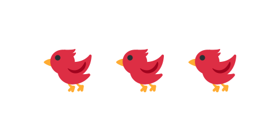

# 09 発射したら次の鳥をセットする



前の [08 スタート画面を作る](../08-start-screen/LECTURE.md) までは、同じ鳥を何度でも引っ張れました。
本物のパチンコゲームは弾（鳥）の数が決まっています。この節では、鳥を撃つと少し待って次の鳥が
セットされる「リロード」を作り、残りの数も表示します。`GameScene` を書き換えます。

> **今回さわる `game/`:** `main.js` の `GameScene` を書き換え

## 残りの鳥を表示する

残りの鳥の数を覚えておき、左上に小さな丸で並べて見せます。

```js
    // 残りの鳥を左上に小さな丸で並べて見せる。白い丸に濃い輪郭線をつける。
    let birdsLeft = 5;
    const reserve = this.add.graphics();
    const drawReserve = () => {
      reserve.clear();
      for (let i = 0; i < birdsLeft; i++) {
        const x = 30 + i * 26;
        reserve.fillStyle(0xffffff, 1);
        reserve.fillCircle(x, 40, 9);
        reserve.lineStyle(2, 0x333333, 1);
        reserve.strokeCircle(x, 40, 9);
      }
    };
```

- `birdsLeft = 5` … 残りの鳥の数。撃つたびに減らします。
- `drawReserve` … 残りの数だけ、白い小さな丸を横に並べて描く関数です。数が変わるたびに呼び直します。

## 鳥を1羽ずつセットする

鳥を毎回作り直す形にします。`spawnBird` で1羽セットし、発射したら少し待ってまたセットします。

```js
    // いま操作できる鳥。発射中やリロード待ちのときは null。
    let bird = null;
    let dragging = false;

    // パチンコの位置に新しい鳥を1羽セットする。
    const spawnBird = () => {
      if (birdsLeft <= 0) return;
      bird = this.add.circle(anchor.x, anchor.y, radius, 0xffffff);
      bird.setStrokeStyle(3, 0x333333);
      this.matter.add.gameObject(bird, {
        shape: { type: 'circle', radius: radius },
        restitution: 0.2,
      });
      bird.setStatic(true);
    };

    drawReserve();
    spawnBird();
```

- `bird = null` … いま操作できる鳥。発射した後やリロード待ちのときは「無い（null）」状態にします。
- `spawnBird` … パチンコの位置に鳥を1羽用意して静的にします。残りが 0 なら何もしません。
- 最初に一度 `drawReserve()` と `spawnBird()` を呼んで、残数表示と最初の1羽を出します。

## 発射したらリロードする

引っ張り・発射の処理を、`bird` があるときだけ動くように直し、発射後にリロードを予約します。

```js
    this.input.on('pointerup', () => {
      if (!dragging || !bird) return;
      dragging = false;
      aim.clear();

      const vx = (anchor.x - bird.x) * power;
      const vy = (anchor.y - bird.y) * power;
      bird.setStatic(false);
      bird.setVelocity(vx, vy);

      // 発射した鳥はもう操作しない。残弾を1つ減らす。
      bird = null;
      birdsLeft -= 1;
      drawReserve();

      // 少し待ってから、次の鳥をパチンコにセットする（リロード）。
      this.time.delayedCall(1200, () => spawnBird());
    });
```

- `if (!dragging || !bird) return` … 引っ張り中でないとき、または鳥がまだ無いときは何もしません。
- 発射後に `bird = null` として、飛んでいった鳥をもう操作できないようにします。
- `birdsLeft -= 1; drawReserve();` … 残りを1つ減らして表示を更新します。
- `this.time.delayedCall(1200, () => spawnBird())` … 1200ミリ秒（1.2秒）待ってから次の鳥をセットします。

## 動かす

鳥を撃つと少し待って次の鳥がパチンコにセットされ、左上の残り数が1つ減ります。
5羽を撃ち切ると鳥が出なくなります。次の節で、撃ち切ったときにゲームオーバー画面へ進むようにします。

::preview[このステップの完成イメージ（実際に触って動かせます）]

::checkpoint{open="main.js"}
