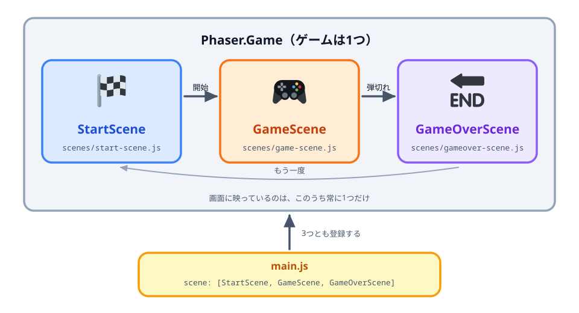
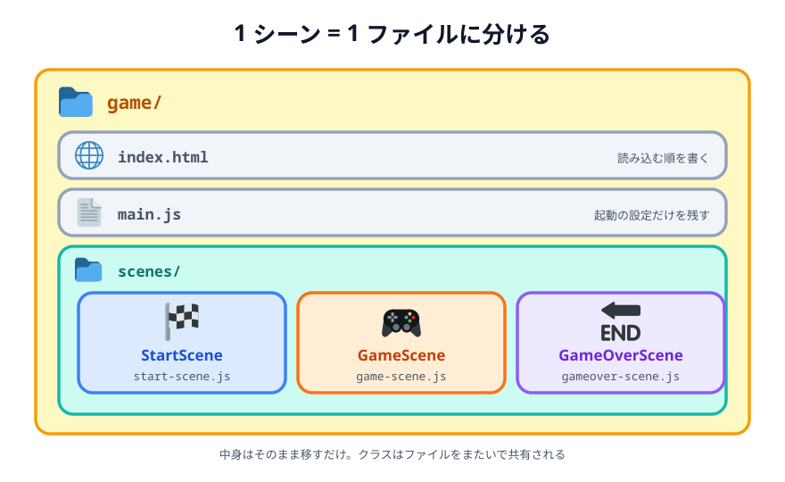

# 11 シーンごとにファイルを分ける


前の [10 弾切れでゲームオーバー](../10-gameover-out/LECTURE.md) で、`main.js` に3つのシーンが
入って長くなりました。この節では**動きは変えず**に、シーンごとにファイルを分けて整理します。
こういう「動きを変えずに整理する作業」をリファクタリングと呼びます。

> **今回さわる `game/`:** ファイル構成を変える（`scenes/` を作る）

## 1つの Game の中に、シーンが3つ入っている

ファイルを分ける前に、いまのゲームの形をおさらいします。08〜10 で作った `StartScene`・
`GameScene`・`GameOverScene` は、それぞれ**別々のゲーム**ではありません。**1つの
`Phaser.Game` の中に、3つのシーンが入っている**という関係になっています。



_図: Game（ゲーム全体）とシーン（画面）の関係。3つとも Game の中にいて、映るのは常に1つ_

- **`Phaser.Game`** … ゲーム全体。ページに1つだけ作ります。画面の大きさや物理エンジンの
  設定は、こちらが持っています。
- **シーン** … Game の中に入る「画面」。いくつでも入れられますが、**実際に動いて画面に
  映るのは常に1つだけ**です。残りは出番を待っています。
- **`scene: [StartScene, GameScene, GameOverScene]`** … Game に「この3つを使う」と
  登録する名簿です。ここに書いたシーンだけを Game は知っています。
- **`this.scene.start('Game')`** … 動かすシーンを切り替える命令。`super('Game')` で付けた
  名前を呼ぶと、Game が名簿から探して切り替えてくれます。

この「Game が3つのシーンを抱えている」という形は、これから何をしても変わりません。この節で
やるのは、**中身の置き場所だけを「1シーン = 1ファイル」に整理する**ことです。

## ファイル構成を変える

`scenes/` フォルダを作り、シーンを1つずつ別ファイルに移します。



_図: `scenes/` を作り、シーンのクラスを 1 つずつ別ファイルに移す。`main.js` には起動の設定だけが残る。_

- `scenes/start-scene.js` … `StartScene` クラスだけを入れます。
- `scenes/game-scene.js` … `GameScene` クラスだけを入れます。
- `scenes/gameover-scene.js` … `GameOverScene` クラスだけを入れます。

中身のコードはそのまま移すだけです。クラスはファイルをまたいで共有されるので、書き換えは要りません。

## main.js は起動だけにする

`main.js` に残すのは、ゲームを起動する設定だけです。

:::code[ファイル全体（起動の設定だけを残す）]{filepath=main.js offset=1}

```js
new Phaser.Game({
  type: Phaser.AUTO,
  width: 720,
  height: 480,
  backgroundColor: '#fdf6e3',
  physics: {
    default: 'matter',
    matter: { gravity: { y: 1 } },
  },
  scene: [StartScene, GameScene, GameOverScene],
});
```

:::

## ファイルを読み込む順番

`index.html` で、分けたファイルを読み込みます。**シーンを先に、`main.js` を最後に**読み込むのが大切です。
`main.js` が起動するとき、3つのシーンのクラスがすでに用意されている必要があるからです。

:::code[`<head>` の中（`<script>` の並びを書き換え）]{filepath=index.html offset=20}

```html
<script src="https://cdnjs.cloudflare.com/ajax/libs/phaser/3.90.0/phaser.min.js"></script>
<script src="scenes/start-scene.js" defer></script>
<script src="scenes/game-scene.js" defer></script>
<script src="scenes/gameover-scene.js" defer></script>
<script src="main.js" defer></script>
```

:::

- 上から順に、Phaser 本体 → 各シーン → `main.js` の順で読み込みます。
- `defer` を付けているので、読み込みの順番どおりに実行されます。

## 動かす

見た目も動きも 10 とまったく同じです。でも、コードがシーンごとに整理されて、これから機能を
足すときに読みやすくなりました。ここまでで「基本」は完成です。次の章から、標的（ブタ）や
スコアなど、ゲームのルールを作っていきます。

::preview[このステップの完成イメージ（実際に触って動かせます）]

::codeview{defaultFile="main.js"}
