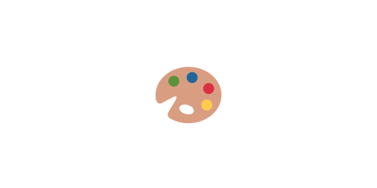

# 01 Canvas とは

ここまでで基本のゲームができました。この章では、その裏で何が起きているのかを少しだけ
のぞいてみます。まずは、ゲームの絵が描かれている **Canvas（キャンバス）** の話です。

## 画面はどう作られている？

ふつうの Web ページは、見出しやボタンなどの「部品（HTML の要素）」を並べて作ります。
部品が1つずつあるので、文字を選んだりリンクを押したりできます。

でもゲームは、たくさんの物がなめらかに動きます。動く物ひとつひとつを部品にすると数が多すぎて
重くなります。そこでゲームでは **Canvas** という「1枚の絵を描くための場所」を使います。

- HTML の部品を並べる方式 … 部品が多いと重い。文書やフォーム向き。
- **Canvas に直接描く方式** … 毎フレーム絵を描き直す。たくさん動くゲーム向き。

Phaser は、この Canvas に「毎フレーム、今の状態の絵を描く」ことをやってくれています。
私たちが `this.add.circle(...)` や `this.add.image(...)` と書くと、Phaser がその物を
毎フレーム Canvas に描いてくれる、というわけです。

## パラパラ漫画のしくみ

Canvas の絵は、1秒間に約60回描き直されています。少しずつ位置を変えた絵を高速で描き直すと、
なめらかに動いて見えます。パラパラ漫画と同じしくみです。

この「毎フレーム描き直す」流れがあるので、鳥の位置を物理エンジンが計算し、その位置に
Phaser が絵を描く、というくり返しでゲームが動いています。次の節では、その位置を計算する
**物理エンジン**を見ていきます。
