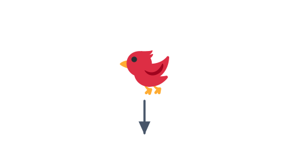

# 02 物理エンジンの仕組み

鳥が落ちたり、箱が崩れたりするのは、**物理エンジン（Matter.js）** が計算してくれているからです。
この節では、物理エンジンが何をしているのかをつかみます。

## 物理エンジンがやっていること

物理エンジンは、画面の中の物に「重さ」や「速さ」「当たり判定の形」を持たせ、毎フレーム
次の位置を計算します。ざっくり言うと、毎フレームこの2つをやっています。

1. **動かす** … 重力や勢いに従って、物を少しだけ動かす。
2. **ぶつける** … 物どうしが重なっていたら押し返し、ぶつかったことを知らせる。

私たちは「重力は下向き」「この丸は半径18」といった設定を渡すだけで、あとはエンジンが
自動で計算してくれます。だから `bird.setVelocity(...)` で勢いを与えるだけで、あとは
放物線を描いて落ちてくれるのです。

## 見た目と当たり判定は別もの

大事なポイントは、**見た目（絵）** と **当たり判定（物理の体）** は別ものだということです。

- 見た目 … `this.add.circle(...)` や `this.add.image(...)` で描く絵。
- 当たり判定 … `this.matter.add.gameObject(..., { shape })` でつける物理の体。

`gameObject` でこの2つを結びつけると、以降は「エンジンが当たり判定の位置を計算 → その位置に
絵を描く」がくり返されます。だから装飾の章で見た目を画像に変えても、当たり判定（`shape`）を
そのままにしておけば、動きは変わりませんでした。

## ぶつかったことを受け取る

エンジンは、物がぶつかると `collisionstart` というお知らせを出します。ゲームロジックの章では、
これを受け取って「鳥がブタに当たった」を判定し、ブタを消していました。物理エンジンは
「動かす・ぶつける」だけを担当し、「当たったらどうするか（ブタを消す・点を足す）」は
私たちがコードで決める、という役割分担です。
