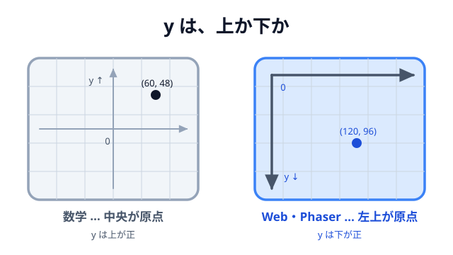

# 01 座標の考え方



02 章では、11 節ぶんのコードを書きました。ここからの 2 節は、手を動かさない休憩です。
書いてきたコードを読み解くための土台を、**位置の数え方**と**部品の関係**の 2 つだけ整理します。

まず位置から。いちばん最初に書いたのは、この 1 行でした。

```js
const bird = this.add.circle(140, 340, 18, 0xffffff);
```

`140` と `340` は位置です。でも「どこから数えた 140 と 340 なのか」は説明していません。
しかも `340` は、学校で習った座標のつもりで読むと**逆向き**です。

位置の数え方は、この先ずっと出てきます。ここで一度そろえておきます。

## 数学の座標

学校で習うのは、こういう座標でした。

- 原点 `(0, 0)` は **真ん中**。
- `x` は右が正、左が負。
- `y` は **上が正**、下が負。
- だから `(3, 2)` は「右に 3、**上に** 2」。

紙の上に自由に軸を引ける前提の数え方です。上下左右にどこまでも伸びていけます。

## Web の座標

ブラウザは、まったく別の数え方をします。

- 原点 `(0, 0)` は **左上**。
- `x` は右が正。
- `y` は **下が正**。
- だから `(3, 2)` は「右に 3、**下に** 2」。

ひっくり返っているのには理由があります。Web ページは**左上から始まって、下に伸びていく**
ものだからです。文章がどれだけ長くなるかは書いてみないと分かりませんが、**左上の角だけは
必ずある**。スクロールも下に向かって増えていきます。「上から数える」ほうが、ページにとっては
自然なのです。

CSS の `top` / `left` も、`element.getBoundingClientRect()` も、すべてこの数え方です。

## Phaser の座標

Phaser は Canvas の上に描くので、**Web の流儀をそのまま使います**。

- ゲーム画面の左上が `(0, 0)`。
- `width: 720, height: 480` なら、右下が `(720, 480)`。
- `y` は下が正。

最初の `this.add.circle(140, 340, ...)` は、「左から 140、**上から** 340」でした。画面の高さが
480 なので、下から数えると 140 の位置。だから鳥は画面の左下のほうにいたわけです。

下のデモで、同じ 1 点を「Web の読み方」と「数学の読み方」の両方で表示しています。
板の上をなぞって、2 つの数字がどうずれるか見てください。

::preview[同じ点を、2 つの座標系で読む。板の上をなぞると数字が変わる]{demo="two-origins" height="500"}

右下に行くほど Web の座標は**両方とも増え**、数学の座標は **`x` は増えて `y` は減る**。
この「`y` だけ逆」が、ずっとついて回ります。

## `y` が下向きだと、何が変わるか

書いてきたコードのあちこちに、この向きが顔を出しています。

**重力は `y` のプラス方向（＝下）です。**

```js
physics: {
  default: 'matter',
  matter: { gravity: { y: 1 } },   // プラス = 下向き
},
```

**上に飛ばす速度はマイナスです。**

```js
bird.setVelocity(12, -12); // 右へ 12、上へ 12
```

[04 クリックで飛ばす](../../02-basic/04-launch/LECTURE.md) の `-12` は、
「上向きだからマイナス」でした。もし `12` にすると、鳥は右下に潜っていきます。

**「下にある」は `y` が大きいことです。**

```js
const groundY = 400; // 地面の上面。数字が大きいほど下にある
```

地面の `400` は、画面の高さ 480 より少し小さい値です。「上から 400 の高さ」＝画面のかなり下、
という読み方になります。

## Phaser だけの約束 — 基準点（origin）

もうひとつ、位置に関する約束があります。**指定した座標が、そのオブジェクトのどこを指すか**です。

- HTML/CSS の要素 … `left` / `top` なので **左上の角**。
- Phaser の**図形・画像** … **中心**（origin は `0.5, 0.5`）。
- Phaser の**テキスト** … **左上**（origin は `0, 0`）。

同じ座標を指定しても、置かれ方が変わります。

::preview[同じ座標 (赤い十字) に置いた 3 つ。基準点が違うと置かれ方が変わる]{demo="origin-compare" height="320"}

テキストを画面の中央にそろえたいときに `.setOrigin(0.5)` を付けていたのは、これが理由です。

```js
this.add
  .text(360, 180, 'パチンコ物理ゲーム', { fontSize: '36px' })
  .setOrigin(0.5); // 左上基準 → 中心基準にそろえる
```

`360` は画面幅 720 のちょうど半分。基準点を中心にしたので、文字が真ん中に来ます。
`setOrigin(0.5)` を忘れると、文字の**左上**が中央に来るので、右にずれて見えます。

### 同じ地面を、2 つの基準で書いている例

[03 地面で受け止める](../../02-basic/03-ground/LECTURE.md) には、この違いがはっきり出ています。

```js
const groundY = 400;

// 見た目：左上の角を指定して塗る
const g = this.add.graphics();
g.fillRect(0, groundY, 720, 480 - groundY);

// 当たり判定：中心を指定して置く
this.matter.add.rectangle(
  360,
  groundY + (480 - groundY) / 2,
  720,
  480 - groundY,
  {
    isStatic: true,
  },
);
```

どちらも同じ帯を表しているのに、数字がまったく違います。

- `fillRect(0, 400, ...)` … Canvas に塗る命令。**左上の角**が `(0, 400)`。
- `matter.add.rectangle(360, 440, ...)` … 物理の体。**中心**が `(360, 440)`。
  横 720 の中心は `360`、縦は `400` から `480` までの真ん中で `440`。

`groundY + (480 - groundY) / 2` という一見ややこしい式は、「上端から、高さの半分だけ下」＝
**中心** を求めているだけです。基準点が違うものを同じ場所に置こうとすると、こういう変換が
必要になります。

## ポインタの座標

マウスや指の位置も、同じ座標で届きます。

```js
this.input.on('pointermove', function (pointer) {
  const dx = pointer.x - anchor.x;
  const dy = pointer.y - anchor.y;
});
```

`pointer.x` / `pointer.y` は **ゲーム画面の左上を原点にした座標**です。ブラウザが本来くれる
`event.clientX` はウィンドウの左上が原点なので、そのままだと「Canvas がページのどこにあるか」の
分だけずれます。その引き算は Phaser がやってくれています。

だから [05 パチンコ](../../02-basic/05-slingshot/LECTURE.md) では、`pointer.x` と `anchor.x` を
そのまま引き算できました。**同じ原点の座標どうしなら、引き算した結果は「向き」になります。**

```js
const vx = (anchor.x - bird.x) * power;
const vy = (anchor.y - bird.y) * power;
```

「パチンコの位置 − 鳥の位置」なので、引っ張った向きと**反対**のベクトルです。鳥を下に引っ張れば
`bird.y` が大きくなり、`anchor.y - bird.y` はマイナス、つまり**上向き**の速度になります。
`y` が下向きの世界でも、引き算の向きさえ合っていれば、符号は自然に合います。

## 数学の座標で考えたいとき

グラフを描くときなど、どうしても「上が正」で考えたい場面があります。そのときは、置く直前に
変換します。

```js
const originX = 360; // 原点をどこに置くか
const originY = 240;

const screenX = originX + mathX;
const screenY = originY - mathY; // y だけ向きを反転する
```

やっていることは「原点をずらして、`y` を反転する」だけです。頭の中で毎回ひっくり返すより、
**変換する場所を 1 か所に決めてしまう**ほうが間違えません。

## まとめ

- 数学は「中央が原点・`y` は上が正」、Web と Phaser は「**左上が原点・`y` は下が正**」。
- ページが左上から下へ伸びるものだから、Web はこの数え方になっている。
- `y` が下向きなので、**重力はプラス、上に飛ばす速度はマイナス**。
- 指定した座標がどこを指すか（基準点）は種類で違う。**図形・画像は中心、テキストは左上**。
- ポインタの座標もゲーム画面の原点でそろっているので、そのまま引き算できる。

次の節では、この座標に置いた**ものたちが、誰に持たれているのか**を見ます。
