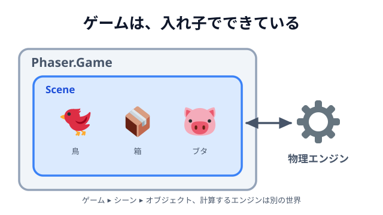
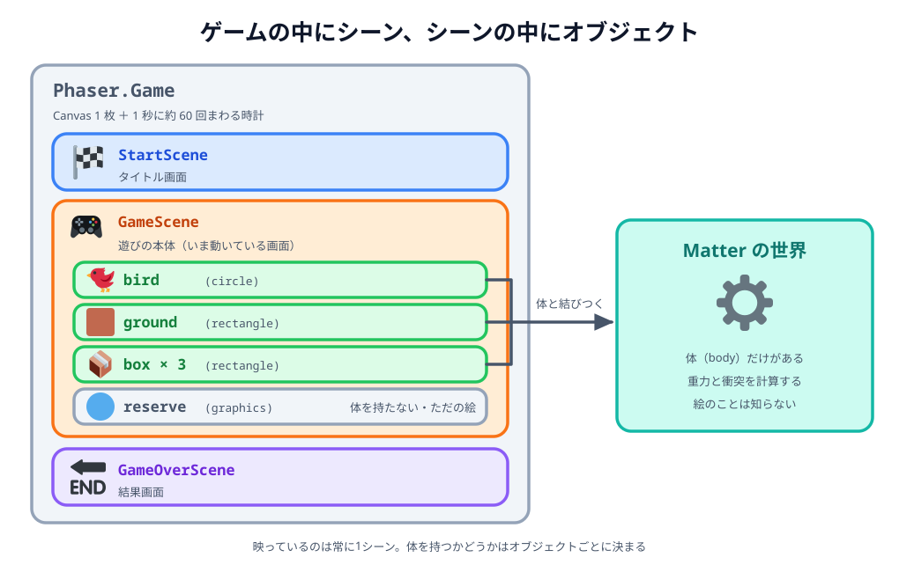
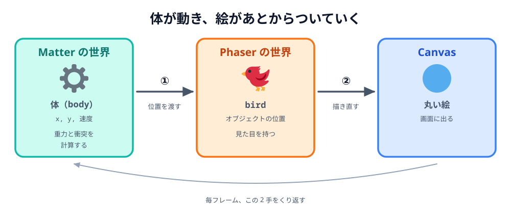

# 02 ゲーム・シーン・オブジェクト・エンジン



前の節で、`this.add.circle(140, 340, ...)` の `140` と `340` が読めるようになりました。
残っているのは、その前半――`this.add` のほうです。

02 章では `new Phaser.Game({ ... })` と書き、`create` の中に `this.add.circle(...)` と書きました。
書いたとおりに動きましたが、**誰が誰を持っているのか**は説明していません。

Phaser のコードは、この「持ち主の関係」が分かると急に読めるようになります。逆にここが
あいまいなまま機能を足していくと、「`this` って何？」「このコードはどこに書けばいいの？」で
止まります。この節では、部品の関係だけを整理します。

## ゲームを構成する 4 つの要素

Phaser のゲームは、役割の違う 4 つの層でできています。

| 要素                           | 役割                                       | コードでの姿                           |
| ------------------------------ | ------------------------------------------ | -------------------------------------- |
| **ゲーム**（Game）             | Canvas を 1 枚用意して、時計を回す         | `new Phaser.Game({ ... })`             |
| **シーン**（Scene）            | 画面ひとつ分の世界。何を置くかを決める     | `class GameScene extends Phaser.Scene` |
| **オブジェクト**（GameObject） | 画面に置かれる「もの」。見た目と位置を持つ | `this.add.circle(...)`                 |
| **エンジン**（Physics）        | ものの動きを計算する                       | `this.matter.add.gameObject(...)`      |

02 章の最後（[11 シーンごとにファイルを分ける](../../02-basic/11-split-scenes/LECTURE.md)）の
状態を、この 4 つで書き出すとこうなります。



_図: 02 章の最後の状態。映っているのは常に1シーンで、体を持つかどうかはオブジェクトごとに決まる。`reserve` は残弾（5 個）の表示で、体は持たない。_

下が、その動いている状態です。この画面の中で「ゲーム」「シーン」「オブジェクト」「エンジン」が
それぞれ何をしているかを、順に見ていきます。

::preview[02 章の最後の状態。1 つのゲームの中に 3 つのシーンが入っている]{src="02-basic/11-split-scenes" height="540"}

## ゲーム — 入れ物であり、時計

`new Phaser.Game({ ... })` は、たった 1 回だけ実行されます。

```js
new Phaser.Game({
  type: Phaser.AUTO,
  width: 720,
  height: 480,
  backgroundColor: '#fdf6e3',
  physics: {
    default: 'matter',
    matter: { gravity: { y: 1 } },
  },
  scene: [StartScene, GameScene, GameOverScene],
});
```

このとき Phaser がやっていることは 4 つです。

- `width` / `height` / `backgroundColor` … **Canvas を 1 枚作って**ページに挿します。
- `physics` … **物理エンジンを準備します**。ここで「重力は下向き」と決めています。
- `scene` … シーンを登録して、**先頭の 1 つを始めます**。
- そして **1 秒に約 60 回の時計を回し始めます**。この時計が、以降すべての「毎フレーム」の正体です。

ゲームはふつう 1 つだけです。そして、このあと書くコードの中で「ゲーム」を直接さわる場面は
ほとんどありません。**設定を渡したら、あとはシーンの世界に入る**、と考えて大丈夫です。

## シーン — 画面ひとつ分の世界

シーンは「いまこの画面には何があって、毎フレーム何をするか」をまとめたものです。

```js
class GameScene extends Phaser.Scene {
  constructor() {
    super('Game'); // このシーンの名前。切り替えるときに使う
  }

  create() {
    // 何を置くか
  }

  update() {
    // 毎フレーム何をするか
  }
}
```

- `super('Game')` … シーンに名前を付けます。`this.scene.start('Game')` の `'Game'` がこれです。
- `create()` … 画面ができたときに 1 回。
- `update()` … 毎フレーム。

ここで一番大事なのは、**`create` や `update` の中の `this` は、そのシーン自身**だということです。
`this.add`・`this.input`・`this.matter`・`this.scene` は、どれもシーンが持っている道具箱です。

| 道具          | 何をするもの                     | 使った節                        |
| ------------- | -------------------------------- | ------------------------------- |
| `this.add`    | オブジェクトを作ってシーンに置く | 01 鳥を表示する                 |
| `this.matter` | 物理エンジンに体を追加する       | 02 鳥に重力を与える             |
| `this.input`  | マウス・指の入力を受け取る       | 04 クリックで飛ばす             |
| `this.scene`  | 画面を切り替える                 | 08 スタート画面を作る           |
| `this.time`   | 少し待ってから実行する           | 09 発射したら次の鳥をセットする |
| `this.load`   | 画像・音を読み込む               | 06 章 鳥・ブタ・箱を画像にする  |

「`this.` の後ろに来るのは、シーンが持っている引き出しの名前」と覚えておくと、知らないコードを
読むときも当たりが付きます。

そして、シーンは **同時に何個でも作れて、切り替えられます**。

```js
this.scene.start('GameOver'); // いまのシーンを終えて、別のシーンへ
```

タイトル・本編・結果を 1 つの画面に詰め込むと、「いまはどの状態か」を自分で管理することに
なります。シーンに分けておけば、それぞれが自分の仕事だけを見ればよくなります。

## オブジェクト — 置かれたもの

```js
const bird = this.add.circle(140, 340, 18, 0xffffff);
```

この 1 行は、2 つのことを同時にやっています。

1. 丸のオブジェクトを **作る**
2. それを **シーンに登録する**

`add`（＝加える）という名前のとおり、後半の「置く」ほうが本体です。置かれたオブジェクトは
シーンが覚えていて、Phaser が**毎フレーム、全部まとめて描き直して**くれます。ゲームの絵は
1 秒に約 60 回、まるごと描き直されています。それでも私たちが「置く」のは 1 回きりでよく、
**置いておけば描き続けてくれる**わけです。だから、あとから位置や色を変えられます。

```js
bird.setPosition(200, 300); // 置いたあとから動かせる
bird.setStrokeStyle(3, 0x333333);
```

置けるものにはいくつか種類がありますが、**シーンから見ればどれも同じ「置かれたもの」**です。

- `this.add.circle` / `this.add.rectangle` … 図形（02 章の白黒）
- `this.add.text` … 文字（スコア表示）
- `this.add.image` … 画像（06 章）

06 章で鳥の丸を画像に差し替えたとき、まわりのコードがほとんど変わらなかったのは、この
「置かれたもの」という扱いが同じだからです。

## エンジンとオブジェクト — 2 つの世界を結ぶ

ここが Phaser でいちばん誤解しやすいところです。

**物理エンジン（Matter.js）は、画面のことを何も知りません。** エンジンが知っているのは
「半径 18 の丸が (140, 340) にあって、速度がこれくらい」という数字だけです。絵の色も、
Canvas の存在も知りません。

- **オブジェクト** … 見た目（絵）
- **体**（body） … 物理の計算対象（形・重さ・速度）

この 2 つを結びつけるのが `gameObject` です。

```js
this.matter.add.gameObject(bird, {
  shape: { type: 'circle', radius: 18 },
  restitution: 0.2,
});
```

結びついたあとは、毎フレームこの順で進みます。



_図: エンジンが計算した体の位置を、Phaser がオブジェクトに移して描き直す。この 2 手が毎フレーム回っている。_

① エンジンが体の新しい位置を計算し、② Phaser がその位置にオブジェクトを移して描き直す。
この繰り返しです。

見た目と体が別ものだと分かると、いくつかの「なぜ」が解けます。

- **06 章で丸を画像に変えても動きが変わらなかった** … 変えたのは①の結果を受け取る絵のほう
  だけで、`shape` はそのままだったからです。
- **[05 パチンコ](../../02-basic/05-slingshot/LECTURE.md) で引っ張る前に `setStatic(true)` した**
  … 引っ張っている間は位置を自分で決めたいのに、エンジンは毎フレーム重力で下へ引こうと
  します。`setStatic(true)` は「この体は、いまは計算しないで」という宣言です。離す瞬間に
  `setStatic(false)` で計算対象に戻し、`setVelocity(...)` で勢いを渡しています。
- **残弾の表示や文字は落ちない** … `gameObject` で体を結びつけていないので、エンジンから見れば
  存在していません。ただの絵です。

エンジンは「動かす・ぶつける」だけを担当し、「当たったらどうするか」は私たちが決める。
この役割分担が、物理エンジンを使うということです。

## なぜ 4 つに分かれているのか

役割で分かれていると、**直す場所がすぐ決まります**。

| 症状                     | 疑う場所                                       |
| ------------------------ | ---------------------------------------------- |
| 当たり判定が絵とずれる   | エンジン（`shape` の大きさ）                   |
| 絵が出ない・色がおかしい | オブジェクト（`this.add` のしかた）            |
| 画面が切り替わらない     | シーン（`scene.start` の名前）                 |
| そもそも何も出ない       | ゲーム（`new Phaser.Game` の設定・読み込み順） |

「動かない」と一括りにせず、**どの層の話か**を先に決められるのが、この分け方のいちばんの
効きどころです。

## まとめ

- **ゲーム**は 1 つ。Canvas と時計を持ち、シーンを動かす。設定を渡したら、あとは出番が少ない。
- **シーン**は画面ひとつ分の世界。`create` / `update` の `this` はシーン自身で、
  `this.add` などはその道具箱。
- **オブジェクト**は「シーンに置かれたもの」。置いておけば Phaser が描き続けてくれる。
- **エンジン**は絵を知らない。`gameObject` で体と絵を結びつけると、計算結果が絵に反映される。

これで、02 章で書いたコードは「なんとなく動くもの」ではなく、**理由のある置き方**として
読めるはずです。休憩はここまで。次の 04 章から、この世界の上に**ゲームのルール**を作っていきます。
