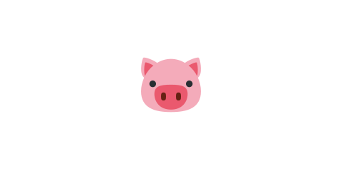

# 01 標的（ブタ）を置く



ここからはゲームのルールを作ります。アングリーバードの目的は「パチンコで飛ばして、標的を全部倒す」
ことです。まずはその標的（ブタ）を置きます。この章からは、変更するのはおもに `scenes/game-scene.js` です。

> **今回さわる `game/`:** `scenes/game-scene.js` を書き換え

## ブタを置く

箱を積んだ後に、標的のブタを2匹置きます。鳥（白い丸）と区別できるよう、灰色の丸にします。

```js
    // 標的（ブタ）を置く。灰色の丸に濃い輪郭線をつけて、鳥と区別する。
    // いまはまだ置くだけ。当たっても消えない。
    const pigRadius = 16;
    const pigPositions = [
      { x: 690, y: groundY - pigRadius }, // タワーの右のブタ
      { x: towerX, y: groundY - boxSize * 3 - pigRadius }, // タワーの上のブタ
    ];
    for (const pos of pigPositions) {
      const pig = this.add.circle(pos.x, pos.y, pigRadius, 0xaaaaaa);
      pig.setStrokeStyle(3, 0x333333);
      this.matter.add.gameObject(pig, {
        shape: { type: 'circle', radius: pigRadius },
        restitution: 0.2,
      });
    }
```

- `pigRadius = 16` … ブタの大きさ（鳥より少し小さめ）。
- `pigPositions` … ブタを置く場所のリスト。1匹は箱タワーの右の地面、もう1匹は箱タワーの上です。
- `for (const pos of pigPositions)` … リストの場所ぶんだけ、くり返してブタを作ります。
- `this.add.circle(..., 0xaaaaaa)` … 灰色の丸でブタを描きます。鳥（白）と見分けられます。
- ブタも物理ボディにするので、鳥や箱がぶつかると押されて動きます。

## 動かす

箱タワーの右と上に、灰色のブタが2匹置かれます。鳥をぶつけると押して動かせますが、
まだ消えません。次の節で、当たったブタが消えるようにします。

::preview[このステップの完成イメージ（実際に触って動かせます）]

::checkpoint{open="scenes/game-scene.js"}
