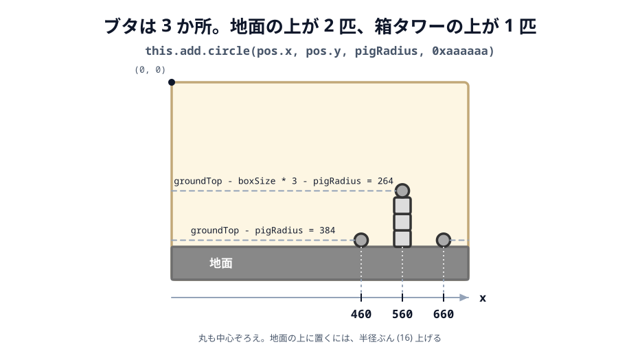

# 01 標的（ブタ）を置く


ここからはゲームのルールを作ります。アングリーバードの目的は「パチンコで飛ばして、標的を全部倒す」
ことです。まずはその標的（ブタ）を置きます。この章からは、変更するのはおもに `scenes/game-scene.js` です。

> **今回さわる `game/`:** `scenes/game-scene.js` を書き換え

## ブタを置く

標的のブタを3匹置きます。鳥（白い丸）と区別できるよう、灰色の丸にします。

:::code[`GameScene` の `create` の中（箱を積む `for` の後）]{filepath=scenes/game-scene.js offset=32}

```js
const pigRadius = 16;
const pigPositions = [
  { x: 460, y: groundTop - pigRadius }, // 手前のブタ
  { x: towerX, y: groundTop - boxSize * 3 - pigRadius }, // タワーの上のブタ
  { x: 660, y: groundTop - pigRadius }, // 奥のブタ
];
for (const pos of pigPositions) {
  const pig = this.add.circle(pos.x, pos.y, pigRadius, 0xaaaaaa);
  pig.setStrokeStyle(3, 0x333333);
  this.matter.add.gameObject(pig, {
    shape: { type: 'circle', radius: pigRadius },
    restitution: 0.2,
  });
}
```

:::

- `pigRadius = 16` … ブタの大きさ（鳥より少し小さめ）。
- `pigPositions` … ブタを置く場所のリスト。箱タワーの手前の地面・箱タワーの上・箱タワーの奥の地面の3か所です。
- `for (const pos of pigPositions)` … リストの場所ぶんだけ、くり返してブタを作ります。
- `this.add.circle(..., 0xaaaaaa)` … 灰色の丸でブタを描きます。鳥（白）と見分けられます。
- ブタも物理ボディにするので、鳥や箱がぶつかると押されて動きます。

3匹の `y` も、鳥や箱と同じ考え方で決めています。丸の絵は**中心**の位置を受け取るので、
地面の上に置くなら半径ぶん（16）、箱タワーの上に置くなら箱 3 段ぶん（120）とさらに半径ぶんだけ
`groundTop` から引きます。



_図: 横位置は 460・560・660。`groundTop` から引く量だけで、高さが決まる。_

## 動かす

箱タワーの手前・上・奥に、灰色のブタが3匹置かれます。鳥をぶつけると押して動かせますが、
まだ消えません。次の節で、当たったブタが消えるようにします。

::preview[このステップの完成イメージ（実際に触って動かせます）]

::codeview{defaultFile="scenes/game-scene.js"}
