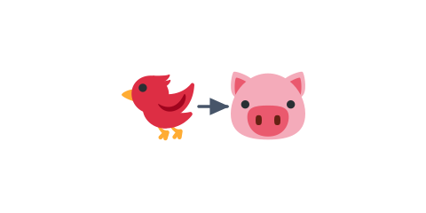

# 02 当たったブタを消す



前の [01 標的（ブタ）を置く](../01-pig/LECTURE.md) で、ブタを置きました。この節では、鳥が当たった
ブタを消します。物理エンジンの「ぶつかった」お知らせを受け取って、消す仕組みを作ります。

> **今回さわる `game/`:** `scenes/game-scene.js` を書き換え

## 鳥とブタに目印をつける

衝突したとき「どれが鳥で、どれがブタか」を見分けられるよう、目印（印の変数）をつけます。
ブタを作るところに `pig.isPig = true`、鳥を作るところに `bird.isBird = true` を足します。

:::code[`create` の中、ブタを作る `for` の中（`this.matter.add.gameObject(pig, ...)` の後）]{filepath=scenes/game-scene.js offset=36}

```js
this.matter.add.gameObject(pig, {
  shape: { type: 'circle', radius: pigRadius },
  restitution: 0.2,
});
pig.isPig = true; // 衝突したときに見分けるための目印。
```

:::

:::code[`create` の中、`spawnBird` の中（`bird.setStatic(true)` の後）]{filepath=scenes/game-scene.js offset=90}

```js
// 待機中は動かないように静的にしておく。
bird.setStatic(true);
bird.isBird = true; // 同じく、鳥かどうかの目印。
```

:::

## 衝突を受け取って消す予約をする

物理エンジンは、何かがぶつかると `collisionstart` というお知らせを出します。これを受け取って、
「鳥」と「ブタ」がぶつかっていたら、そのブタを**消す予約**に入れます。

:::code[`create` の中（ブタを置く `for` の後）]{filepath=scenes/game-scene.js offset=43}

```js
// 衝突中に消すと不安定なので、ためて update でまとめて消す。
this.pendingRemoval = new Set();

this.matter.world.on('collisionstart', (event) => {
  for (const pair of event.pairs) {
    const gameObjectA = pair.bodyA.gameObject;
    const gameObjectB = pair.bodyB.gameObject;
    if (!gameObjectA || !gameObjectB) continue;
    if (gameObjectA.isBird && gameObjectB.isPig)
      this.pendingRemoval.add(gameObjectB);
    if (gameObjectB.isBird && gameObjectA.isPig)
      this.pendingRemoval.add(gameObjectA);
  }
});
```

:::

- `this.pendingRemoval = new Set()` … 「これから消すブタ」をためておく入れ物です。
- `this.matter.world.on('collisionstart', ...)` … 何かがぶつかった瞬間に呼ばれます。
- `event.pairs` … ぶつかった相手の組み合わせのリスト。1つずつ調べます。
- `pair.bodyA.gameObject` … ぶつかった物の見た目（鳥・ブタ・箱）。壁や地面は持っていないので `null` になります。
- `if (a.isBird && b.isPig)` … 片方が鳥・もう片方がブタなら、そのブタを消す予約に入れます。逆の組み合わせも見ます。

## まとめて消す

ぶつかった瞬間にその場で消すと不安定になりがちなので、毎フレーム呼ばれる `update` で
まとめて消します。

:::code[`GameScene` クラスの中（`create` の後に、メソッドとして追加）]{filepath=scenes/game-scene.js offset=148}

```js
  update() {
    for (const pig of this.pendingRemoval) {
      pig.destroy();
    }
    this.pendingRemoval.clear();
  }
```

:::

- `update()` … 毎フレーム自動で呼ばれるメソッドです。
- `pig.destroy()` … ブタを画面と物理世界から消します。
- `this.pendingRemoval.clear()` … 消し終わったら、予約の入れ物を空にします。

## 動かす

鳥をブタに当てると、ブタが消えます。箱を崩して道を作り、奥のブタに当てる楽しさが出てきました。
次の節で、ブタを全部倒したら「クリア」になるようにします。

::preview[このステップの完成イメージ（実際に触って動かせます）]

::codeview{defaultFile="scenes/game-scene.js"}
