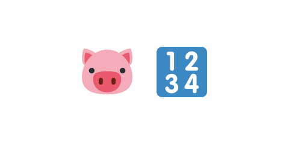

# 04 ブタを倒してスコアを足す



前の [03 全ブタを倒したらクリア](../03-clear/LECTURE.md) で、勝ち負けができました。この節では、
ブタを倒すたびにスコアを足して、画面に表示します。

> **今回さわる `game/`:** `scenes/game-scene.js` を書き換え

## スコアの表示を用意する

スコアと、その表示（右上の文字）を用意します。

:::code[`create` の中（`this.pigsLeft` を決めたコードの後）]{filepath=scenes/game-scene.js offset=55}

```js
this.score = 0;
this.scoreText = this.add
  .text(700, 30, 'スコア: 0', { fontSize: '20px', color: '#333333' })
  .setOrigin(1, 0.5);
```

:::

- `this.score = 0` … スコアの数。最初は 0 です。
- `this.scoreText` … スコアを表示する文字。`setOrigin(1, 0.5)` で右端そろえにして、右上に置きます。

## 倒すたびに加点する

ブタを消すたびに、スコアを足して表示を更新します。

:::code[`update` の中の `for (const pig of this.pendingRemoval)` の中]{filepath=scenes/game-scene.js offset=158}

```js
for (const pig of this.pendingRemoval) {
  pig.destroy();
  this.pigsLeft -= 1;
  this.score += 1000;
  this.scoreText.setText('スコア: ' + this.score);
}
```

:::

- `this.score += 1000` … ブタ1匹につき 1000 点を足します。
- `this.scoreText.setText('スコア: ' + this.score)` … 表示の文字を新しいスコアに書き換えます。

## 動かす

ブタを倒すたびに、右上のスコアが 1000 ずつ増えます。まだ結果画面にはスコアが出ません。
次の節で、クリア・ゲームオーバー画面にスコアを表示します。

::preview[このステップの完成イメージ（実際に触って動かせます）]

::codeview{defaultFile="scenes/game-scene.js"}
