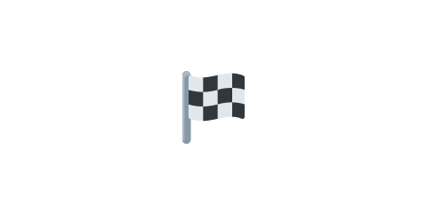

# 05 リザルトにスコアを表示



前の [04 ブタを倒してスコアを足す](../04-score/LECTURE.md) で、スコアがつきました。この節では、
クリア画面とゲームオーバー画面にも最終スコアを表示します。ゲームの結果を伝える「リザルト画面」の
完成です。

> **今回さわる `game/`:** `scenes/game-scene.js`・`scenes/clear-scene.js`・`scenes/gameover-scene.js` を書き換え

## 結果画面にスコアを渡す

シーンを切り替えるとき、2つ目の引数で好きなデータを渡せます。ここでスコアを渡します。
`GameScene` の、クリアへ進む所とゲームオーバーへ進む所を書き換えます。

```js
    // クリアへ進むとき
    if (!this.cleared && this.pigsLeft <= 0) {
      this.cleared = true;
      // 結果画面にスコアを渡す。
      this.scene.start('Clear', { score: this.score });
    }
```

```js
      // ゲームオーバーへ進むとき
      this.time.delayedCall(1200, () => {
        if (birdsLeft > 0) {
          spawnBird();
        } else {
          // 結果画面にスコアを渡す。
          this.scene.start('GameOver', { score: this.score });
        }
      });
```

- `this.scene.start('Clear', { score: this.score })` … クリア画面へ進むとき、いまのスコアを一緒に渡します。

## 結果画面で受け取って表示する

受け取り側の `create` は `create(data)` と書くと、渡されたデータを受け取れます。
`ClearScene` にスコアの表示を足します。

```js
  create(data) {
    // ゲーム画面から渡されたスコア（無ければ 0）。
    const score = data.score || 0;

    this.add
      .text(400, 180, 'クリア！', {
        fontSize: '40px',
        color: '#2e7d32',
        fontStyle: 'bold',
      })
      .setOrigin(0.5);

    this.add
      .text(400, 250, 'スコア: ' + score, {
        fontSize: '28px',
        color: '#333333',
      })
      .setOrigin(0.5);

    this.add
      .text(400, 320, 'クリックでスタートに戻る', {
        fontSize: '18px',
        color: '#555555',
      })
      .setOrigin(0.5);

    this.input.once('pointerdown', () => this.scene.start('Start'));
  }
```

- `create(data)` … シーンを始めるときに渡されたデータ（`{ score }`）を受け取ります。
- `data.score || 0` … スコアが渡されていればその値、無ければ 0 を使います。

`GameOverScene` にも同じようにスコアの表示を足します（見出しの文字が「ゲームオーバー」になるだけです）。

## 動かす

クリアしても、鳥を撃ち切って負けても、結果画面に最終スコアが出るようになりました。
これで「パチンコで飛ばして標的を倒し、スコアを競う」ゲームの中身が完成です。
次の章から、画像や音をつけて仕上げていきます。

::preview[このステップの完成イメージ（実際に触って動かせます）]

::checkpoint{open="scenes/game-scene.js"}
