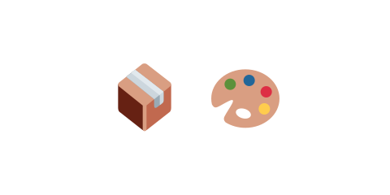

# 01 装飾なしで作る

この教材では、白黒の丸や四角だけでゲームの中身を作り、画像や音は最後にまとめて足しました。
この節では、なぜ「装飾を後まわしにする」のかを考えます。

## 見た目から作ると、つまずきやすい

いきなり鳥やブタの画像を用意して作り始めると、次のような困りごとが起きがちです。

- 画像の読み込みや位置合わせに時間がかかり、肝心の「飛ぶ・当たる・崩れる」がなかなか進まない。
- うまく動かないとき、原因が「ロジックのせい」なのか「画像のせい」なのか切り分けにくい。
- 見た目に凝りだすと、ゲームとして遊べる状態に なかなか たどり着かない。

## 白黒で作ると、確かめやすい

丸や四角だけなら、用意するものが少なく、すぐに動かして確かめられます。

- 物理・操作・勝敗といった**仕組みだけ**に集中できる。
- おかしな動きがあっても、原因はロジックだと分かる（見た目は単純だから）。
- 「遊べる状態」に早くたどり着くので、面白さの手ごたえを早く確認できる。

実際この教材でも、白黒のまま「パチンコで飛ばす → 箱を崩す → ブタを倒す → クリア／スコア」まで
完成させてから、最後に画像と音をかぶせました。中身ができていれば、装飾は見た目を差し替えるだけの
作業になり、安全に進められます。

## まとめ

**「動く仕組み」を先に、「見た目・音」を後に。** これが、迷わず作り切るためのコツです。
次の節では、もう少し具体的に「どんな順番で作るか」を見ます。
