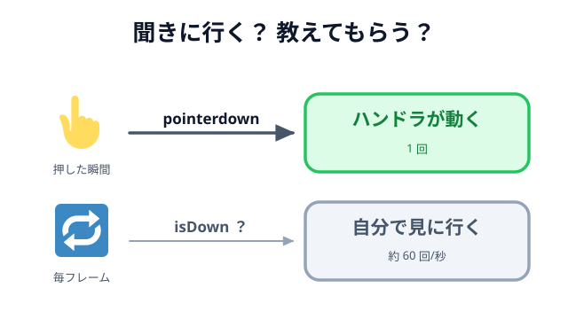

# 01 イベントハンドリング



04 章で、ゲームらしいルールがそろいました。ブタに当たったら消える、全部倒したらクリア、
撃ち切ったらゲームオーバー。よく見ると、どれも「**何かが起きたら、何かをする**」という同じ
形をしています。

ここからの 2 節は、また手を動かさない休憩です。この「起きたら、する」を Phaser がどう
扱っているのか、**イベント**と**ライフサイクル**の 2 つに分けて見ます。まずイベントからです。

## 2 つのやり方 — 聞きに行く／教えてもらう

「クリックされたら発射する」を作るとき、方法は 2 通りあります。

**毎フレーム、聞きに行く（ポーリング）**

```js
update() {
  if (this.input.activePointer.isDown) {
    // 押されている「間」ずっと通る（1 秒に約 60 回）
  }
}
```

**起きたら、教えてもらう（イベント）**

```js
create() {
  this.input.on('pointerdown', (pointer) => {
    // 押した「瞬間」に 1 回だけ通る
  });
}
```

違いは、`if` の中を何回通るかです。下のデモで、クリックしたり、押したままドラッグしたり
してみてください。2 つの数字がまったく違う伸び方をします。

::preview[同じ操作を、イベント（回数）とポーリング（フレーム数）で数えている]{demo="poll-vs-event" height="350"}

::codeview{path="demos/poll-vs-event" defaultFile="main.js"}

- **ポーリング** は「いま押されているか」という**状態**を聞いています。押しっぱなしなら、
  ずっと `true` です。
- **イベント** は「押された」という**出来事**を受け取っています。押した瞬間に 1 回だけです。

パチンコで `pointerdown` を使ったのは、「押した瞬間に鳥を構え直す」が 1 回だけ起きてほしい
からです。ポーリングで書くと、押している間ずっと構え直すことになり、鳥がその場に固まります。

一方、「押している間ずっと力をためる」ようなゲームなら、ポーリングのほうが素直です。
**瞬間をとらえたいならイベント、続いている状態を見たいならポーリング**、が目安です。

## イベントの 3 つの部品

イベントを書くとき、必ず 3 つのことを決めています。

```js
// 発生源.on('名前', ハンドラ)
this.input.on('pointerdown', (pointer) => {
  bird.setPosition(pointer.x, pointer.y);
});
```

- **発生源** … 誰が知らせてくれるか。`this.input`、`this.matter.world`、オブジェクト自身。
- **名前** … 何が起きたか。`'pointerdown'`、`'collisionstart'`。
- **ハンドラ** … どうするか。**あとから呼ばれる関数**です。

3 つ目に注目してください。ハンドラも、**自分では呼びません**。用意しておくと、Phaser が
呼びます。`create` が「シーンが始まったら呼ばれる関数」であるのと同じで、ハンドラは
「その出来事が起きたら呼ばれる関数」です。**用意しておくと、向こうから呼ばれる。** この形は
次の節でもう一度出てきます。

そして、ハンドラの引数には詳しい情報が届きます。`pointer.x` / `pointer.y` は
**ゲーム画面の左上を原点にした座標**でした（[03 章 座標の考え方](../../03-reading-phaser/01-coordinates/LECTURE.md)）。
だから、そのまま `setPosition` に渡せます。

下のデモは、届いたイベントをこの 3 列のまま並べています。押した場所に丸が飛ぶのは、
受け取った `pointer` をそのまま渡しているからです。

::preview[届いたイベントを「発生源・名前・ハンドラの引数」の 3 列で並べている]{demo="event-parts" height="330"}

::codeview{path="demos/event-parts" defaultFile="main.js"}

## ブラウザのイベントと同じ形

この形は Phaser が発明したものではありません。ブラウザにもともとある考え方です。

```js
// ブラウザ
button.addEventListener('click', (event) => {
  /* ... */
});

// Phaser
this.input.on('pointerdown', (pointer) => {
  /* ... */
});
```

名前が `addEventListener` か `on` かの違いだけで、構造は同じです。Node.js の `emitter.on(...)`、
Vue の `@click`、React の `onClick` も同じ発想です。**イベントは、特定のフレームワークの機能
ではなく、Web 全体で共通の考え方**だと思ってかまいません。ひとつ覚えれば、だいたい通用します。

左は Phaser をまったく使っていない、素の HTML のボタンです。並べてみると、登録している行が
同じ形をしているのが分かります。

::preview[左は素の HTML、右は Phaser。登録の書き方は同じ形をしている]{demo="dom-and-phaser" height="315"}

::codeview{path="demos/dom-and-phaser" defaultFile="main.js"}

## このゲームで使ったイベント

| 名前             | 発生源                              | 使った場所                                  |
| ---------------- | ----------------------------------- | ------------------------------------------- |
| `pointerdown`    | `this.input`（画面全体）            | 02 章 04 クリックで飛ばす / 05 引っ張り始め |
| `pointermove`    | `this.input`                        | 02 章 05 引っ張っている間の位置更新         |
| `pointerup`      | `this.input`                        | 02 章 05 離して発射                         |
| `pointerdown`    | `startText`（部品そのもの）         | 02 章 08 スタート画面のボタン               |
| `collisionstart` | `this.matter.world`（物理エンジン） | 04 章 02 当たったブタを消す                 |

発生源が 3 種類あることに気づきます。**画面全体**・**部品ひとつ**・**エンジン**。
これは [03 章](../../03-reading-phaser/02-phaser-model/LECTURE.md) で見た「誰が何を
持っているか」がそのまま出ています。イベントは、**その持ち主から出てくる**のです。

下は、この 4 つだけを取り出した小さなパチンコです。鳥を引っ張って離すと、どのイベントが
いつ発火しているかがランプで分かります。`pointermove` が、引っ張っていないときも
ずっと光り続けることに注目してください。だからハンドラの先頭に `if (!dragging) return;` が
要るわけです。

::preview[鳥を引っ張って離すと、発火したイベントのランプが光る]{demo="game-events" height="450"}

::codeview{path="demos/game-events" defaultFile="main.js"}

## 画面全体か、その部品か

同じ `pointerdown` でも、どこに登録するかで意味が変わります。

```js
// 画面のどこを押しても反応する
this.input.on('pointerdown', () => {
  /* ... */
});

// その部品を押したときだけ反応する
startText.setInteractive({ useHandCursor: true });
startText.on('pointerdown', () => this.scene.start('Game'));
```

`setInteractive()` は「**このオブジェクトは、押される対象です**」という宣言です。Phaser は、
置かれたオブジェクト全部の当たり判定を毎回調べたりはしません。宣言したものだけを調べます。

そのため、`setInteractive()` を忘れると、`on('pointerdown', ...)` をいくら書いても
**何も起きません**。エラーも出ないので、はじめのうちは必ず一度はまります。ボタンが反応しない
ときは、まずここを見てください。

`useHandCursor: true` は、その上にマウスを載せたときにカーソルを指の形にする指定です。
「押せます」と見た目で伝えるための、ちょっとした親切です。

下のデモでは、`setInteractive()` を後から外せます。外した状態でボタンを押してみてください。
画面全体のカウンタだけが増えて、ボタンのカウンタは止まったままになります。

::preview[setInteractive() を外すと、ボタン側だけが無言で反応しなくなる]{demo="interactive-toggle" height="390"}

::codeview{path="demos/interactive-toggle" defaultFile="main.js"}

## 1 回だけ受け取る

結果画面では、`on` ではなく `once` を使っていました。

```js
this.input.once('pointerdown', () => this.scene.start('Start'));
```

`once` は「1 回受け取ったら、自動で登録を外す」という指定です。結果画面は 1 回クリックされたら
スタート画面に戻るだけなので、2 回目以降は必要ありません。連打で二重に切り替わる事故も防げます。

下のデモは、同じ `pointerdown` に `on` と `once` を 1 つずつ登録しています。連打すると、
`once` のほうだけが 1 で止まり、登録されているハンドラの数も 1 つ減ります。

::preview[同じイベントに on と once を 1 つずつ。連打すると once だけ止まる]{demo="on-vs-once" height="350"}

::codeview{path="demos/on-vs-once" defaultFile="main.js"}

## 登録は create で 1 回だけ

ここで効いてくるのが、**コードを書く場所**です。`create` は画面ができたときに 1 回だけ、
`update` は毎フレーム呼ばれる場所でした。

```js
// 悪い例：登録を update に書いてしまった
update() {
  this.input.on('pointerdown', () => { this.score += 1; });
}
```

`update` は毎フレーム呼ばれます。つまり、**1 秒間に約 60 個のハンドラが登録されます**。
10 秒放置してから 1 回クリックすると、スコアが 600 増えます。

このバグのいやらしいところは、**エラーが出ない**ことです。動くには動く。ただ「なんだか多く
入る」だけ。しかも放置した時間によって増え方が変わるので、再現もしにくい。

下のデモで、実際に体験できます。悪い例に切り替えたら、**しばらく放置してから 1 回だけ**
クリックしてみてください。放置した秒数 × 60 くらいの点が、一度に入ります。

::preview[update に登録すると、1 回のクリックでハンドラの数だけスコアが入る]{demo="register-in-create" height="410"}

::codeview{path="demos/register-in-create" defaultFile="main.js"}

覚え方はかんたんです。**登録は `create`、判断は `update`**。

```js
create() {
  this.input.on('pointerdown', () => { this.wantsLaunch = true; });   // 登録は 1 回
}

update() {
  if (this.wantsLaunch) { /* ... */ }                                 // 判断は毎フレーム
}
```

## すぐにやらない、という選択

[04 章 当たったブタを消す](../../04-game-logic/02-hit-pig/LECTURE.md) では、
少し変わった書き方をしていました。

```js
this.matter.world.on('collisionstart', (event) => {
  // ここでは「消す予約」だけをする
  if (a.isBird && b.isPig) this.pendingRemoval.add(b);
});

update() {
  // 実際に消すのは、毎フレームのここ
  for (const pig of this.pendingRemoval) pig.destroy();
  this.pendingRemoval.clear();
}
```

なぜ、ぶつかった瞬間に消さないのでしょうか。

`collisionstart` は、**物理エンジンが計算している最中**に呼ばれます。エンジンが「いま、この
2 つがぶつかっている」と処理している途中で、その片方を消してしまうと、エンジンが足元を
すくわれます。だから「予約」だけしておいて、計算が終わったあとの `update` でまとめて消します。

下のデモは、そのタイミングを目に見えるようにしたものです。ログの「物理計算中」の列に注目
してください。`collisionstart` が届いた行は**はい**、`update` で消している行は**いいえ**に
なります。フレーム番号も 1 つずれます。予約したものが実際に消えるのは、**次のフレーム**です。

::preview[collisionstart は物理計算の最中に届き、update は計算が終わってから呼ばれる]{demo="defer-removal" height="480"}

::codeview{path="demos/defer-removal" defaultFile="main.js"}

**イベントの中では、状態を書き換えるだけにして、重い処理や消す処理は次のフレームに回す。**
ゲームに限らず、イベント駆動のコードでよく出てくる型です。

## 片付けはどうなるのか

シーンを離れるとき、そのシーンに登録したイベントは Phaser が片付けてくれます。だから、
この教材では一度も「イベントを外す」コードを書いていません。

ただし、**どこまで自動で片付くかはフレームワークごとに違います**。ブラウザの
`addEventListener` は、外すのは自分の仕事です。React のように「登録したら、去るときに自分で
外す」と決まっているものもあります（次の節で見ます）。

下のデモは、その差をそのまま見せています。「シーンをやり直す」を何回か押してから 1 回だけ
クリックしてください。Phaser 側は何回やり直しても `+1` のままですが、自分でつけた
`addEventListener` は、やり直した回数だけ反応します。

::preview[やり直すたびに、外していない DOM のハンドラだけが積み上がっていく]{demo="cleanup" height="400"}

::codeview{path="demos/cleanup" defaultFile="main.js"}

新しいフレームワークを触るときは、「登録したものは、誰が、いつ外すのか」をドキュメントで
確認しておくと、あとで「なぜか二重に反応する」に悩まずにすみます。これも結局、
**そのフレームワークの流れに乗る**という話です。

## まとめ

- **ポーリング**は状態を聞きに行く、**イベント**は出来事を受け取る。瞬間をとらえたいなら
  イベント。
- イベントは「**発生源・名前・ハンドラ**」の 3 点セット。ブラウザでも Phaser でも形は同じ。
- ハンドラは自分では呼ばない。**登録は `create` で 1 回だけ**、判断は `update`。
- 部品そのものを押させたいときは `setInteractive()`。忘れると、無言で反応しなくなる。
- イベントの中では書き換えだけにして、消す処理は `update` に回すと安全。

`this.input.on(...)` も `collisionstart` も、正体は「用意しておくと呼ばれる関数」でした。
では、その `create` や `update` そのものは、誰が、いつ呼んでいるのでしょうか。次の節では、
その**呼ばれる順番**（ライフサイクル）を見ます。
