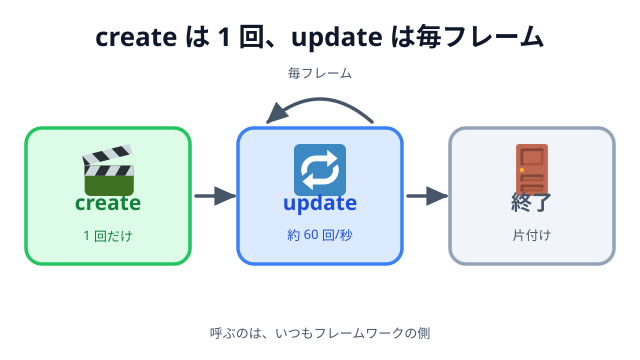
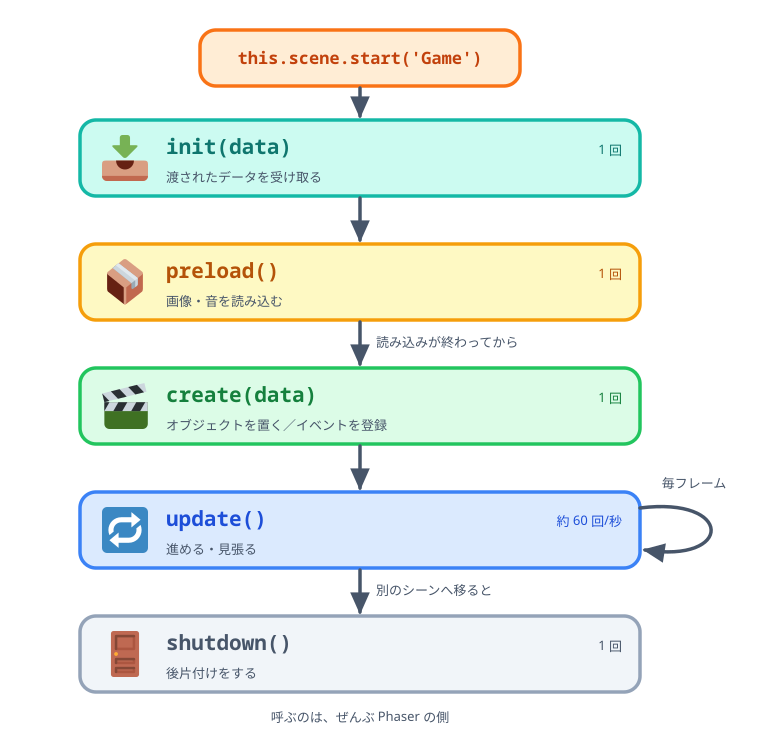

# 02 ライフサイクル



前の節の最後に、こう書きました――イベントのハンドラは「用意しておくと、向こうから呼ばれる
関数」だと。実は同じことが、もっと手前でも起きています。

ここまで、コードを書く場所は 2 つありました。

- `create` に書いたことは、**1 回だけ**起きる。
- `update` に書いたことは、**毎フレーム**起きる。

不思議なのは、`create()` も `update()` も、**自分ではどこからも呼んでいない**ことです。
それでも呼ばれます。この「いつ、何が、誰に呼ばれるか」の決まりごとを **ライフサイクル**と
呼びます。

## create と update

まずは実物を見ます。下のデモは、`create` と `update` が呼ばれた回数をそのまま表示しています。

::preview[create は 1 回、update は毎フレーム。ボタンでやり直すと create がもう 1 回走る]{demo="create-update" height="400"}

::codeview{path="demos/create-update" defaultFile="main.js"}

`update` の回数はぐんぐん増えて、1 秒あたり約 60 回に落ち着きます。これが「フレーム」です。
大事なところだけ取り出すと、こうなります。

```js
create() {
  this.frames = 0;
  this.ball = this.add.circle(60, 180, 16, 0xffffff);   // 置くのは 1 回
}

update() {
  this.frames += 1;
  this.ball.x += this.speed;                            // 動かすのは毎フレーム
}
```

- `create` … **置く・作る・登録する**。1 回でいいこと。
- `update` … **進める・見張る**。毎回やらないといけないこと。

この使い分けを間違えると、すぐに壊れます。

```js
// 悪い例：置く作業を update に書いてしまった
update() {
  this.add.circle(140, 340, 18, 0xffffff);   // 1 秒に 60 個ずつ丸が増え続ける
}
```

画面上は「白い丸が 1 個ある」ようにしか見えません。でも実際には毎秒 60 個のオブジェクトが
積み上がっていき、しばらくすると重くなって止まります。**見た目が正しくても間違っている**
タイプのバグで、原因に気づきにくいものの代表です。

## 自分では呼ばない

もう一度、大事なところを確認します。私たちのコードのどこにも `this.create()` や
`this.update()` という呼び出しはありません。**呼ぶのは Phaser です。**

これは、道具の使い方として大きな違いです。

|                    | 呼ぶ人 | 例                                              |
| ------------------ | ------ | ----------------------------------------------- |
| **ライブラリ**     | 自分   | `Math.hypot(dx, dy)` を、自分の好きなときに呼ぶ |
| **フレームワーク** | 相手   | `create()` を用意しておくと、Phaser が呼ぶ      |

私たちが書くのは「**呼ばれたときにやること**」です。主導権は向こう側にあります。これは
「こちらから電話しないでください。用があればこちらからかけます」という関係にたとえて、
**ハリウッドの原則**と呼ばれることもあります。

下のデモで、その違いをそのまま並べています。左の数字はボタンを押したときだけ増えます。
右の数字は、何もしていなくても増え続けます。**増やしているコードは、どちらも 1 行だけ**です。

::preview[左は自分で呼んだときだけ増え、右は放っておいても増え続ける]{demo="who-calls" height="380"}

::codeview{path="demos/who-calls" defaultFile="main.js"}

フレームワークを使うのがはじめてだと、この逆転が気持ち悪く感じます。でも慣れると
「書く場所さえ間違えなければ、呼ぶタイミングは考えなくていい」という**楽**に変わります。

## Phaser のライフサイクル

シーンが始まってから終わるまで、Phaser は決まった順番でメソッドを呼びます。



_図: シーンのライフサイクル。上から下へ決まった順に呼ばれ、`update` だけがその場で回り続ける_

この教材に出てくるものを当てはめると、こうなります。

| 場所                     | やること                                                    | 節                                       |
| ------------------------ | ----------------------------------------------------------- | ---------------------------------------- |
| `preload()`              | `this.load.image('bird', 'assets/1f426.png')`               | 06 章 鳥・ブタ・箱を画像にする（次の章） |
| `create(data)`           | オブジェクトを置く、`this.input.on(...)` を登録する         | 02 章のほぼ全部                          |
| `create(data)` の `data` | `this.scene.start('Clear', { score })` で渡した値を受け取る | 04 章 結果にスコアを表示             |
| `update()`               | 消す予約のブタをまとめて消す                                | 04 章 当たったブタを消す                 |

順番には意味があります。**`preload` が `create` より前にある**のは、「読み込みが終わってから
置く」を Phaser が保証してくれているからです。おかげで `create` の中では、画像が読めているかを
気にせず `this.add.image('bird', ...)` と書けます。順番が決まっているというのは、**こちらが
確認しなくてよくなる**ということです。

そして `update` は「シーンが動いている間だけ」呼ばれます。別のシーンに移れば、そのシーンの
`update` は止まり、移った先の `update` が回り始めます。

下のデモは、呼ばれたメソッドを呼ばれた順にそのまま記録しています。「別のシーンへ移る」を
押すと、`shutdown` → `init` → `preload` → `create` の順に並ぶのが見えます。この 4 行を
呼び出しているコードは、どこにも書いていません。

::preview[呼ばれたメソッドを、呼ばれた順に記録している。シーンを移ると shutdown から始まる]{demo="lifecycle-order" height="385"}

::codeview{path="demos/lifecycle-order" defaultFile="main.js"}

## 他のフレームワークのライフサイクル

「決まった場所に書くと、決まったタイミングで呼ばれる」という作りは、Phaser 特有のものでは
ありません。

### React の場合

```jsx
function Timer() {
  const [count, setCount] = useState(0);

  useEffect(() => {
    const id = setInterval(() => setCount((c) => c + 1), 1000);
    return () => clearInterval(id); // 片付け
  }, []);

  return <p>{count} 秒</p>;
}
```

- 関数の本体 … 画面を作るところ。**状態が変わるたびに呼び直されます**。
- `useEffect(fn, [])` … 最初の 1 回だけ。Phaser の `create` に近い役割です。
- `return () => { ... }` … 去るときの片付け。Phaser の `shutdown` に近いものです。

ここでも、`Timer()` を自分で呼ぶことはありません。React が呼びます。

### Vue の場合

```js
onMounted(() => {
  /* 最初の 1 回 */
});
onUnmounted(() => {
  /* 去るときの片付け */
});
```

名前は違いますが、置き場所の考え方は同じです。

### 並べてみる

| やりたいこと            | Phaser                       | React                                    | Vue            |
| ----------------------- | ---------------------------- | ---------------------------------------- | -------------- |
| 最初に 1 回だけ準備する | `create()`                   | `useEffect(fn, [])`                      | `onMounted`    |
| 変化に合わせて動かす    | `update()`（**毎フレーム**） | 再レンダリング（**状態が変わったとき**） | 再レンダリング |
| 去るときに片付ける      | シーンの終了時               | `useEffect` の返り値                     | `onUnmounted`  |

一番下の 2 行は似ていますが、**真ん中の行だけは別ものです**。`update` は「時間が進んだから」
呼ばれ、React の再レンダリングは「状態が変わったから」呼ばれます。何もしなければ、Phaser の
`update` は回り続け、React の画面は動きません。

下のデモは、その 2 つを本当に同時に動かしています。左の Phaser は放っておいても数字が増え、
右の React はボタンを押すまで何も起きません。

::preview[左は時間で動く Phaser、右は状態で動く React。同じページで同時に動いている]{demo="react-vs-phaser" height="305"}

::codeview{path="demos/react-vs-phaser" defaultFile="main.js"}

## フレームワークには哲学がある

この違いは、優劣ではありません。**扱っている問題が違う**のです。

- **Phaser の世界観**「世界は、時間とともに動き続ける」
  鳥は誰も操作しなくても落ちます。箱は勝手に崩れます。だから **時間が主役**で、
  毎フレーム呼ばれる `update` が中心にあります。
- **React の世界観**「画面は、状態から計算される」
  フォームは、入力しなければ何も変わりません。だから **状態が主役**で、状態が変わったときだけ
  作り直します。動いていないのに毎秒 60 回作り直すのは、ただの無駄です。

ライフサイクルは、その哲学がいちばんはっきり形になった場所です。**「いつ呼ばれるか」の設計が、
そのフレームワークの世界観そのもの**だと言えます。

### 逆らうと、たいてい損をする

フレームワークの流れから外れた書き方も、たいてい「動いてしまいます」。問題は、そのあとです。

- `update` でオブジェクトを作り続ける … 増え続けて、いつか重くなる。
- `update` でイベントを登録する … 1 回のクリックが何十回も反応する（→ 前の節）。
- React で `document.querySelector` して直接 DOM を書き換える … 次の再レンダリングで消える。

どれも、書いた直後は正しく見えます。壊れるのは、**フレームワークが自分の仕事をしたとき**です。
自分のコードは変えていないのに突然おかしくなるので、原因を追うのがとても大変になります。

1 つめを、下のデモで確かめられます。悪い例に切り替えても、**画面の見た目は何も変わりません**。
白い丸は 1 個に見えたままです。変わるのは、丸の個数と 1 秒あたりのコマ数だけ。
「見た目が正しくても間違っている」というのは、こういう状態のことです。

::preview[見た目は変わらないのに、丸の数だけが増えてコマ数が落ちていく]{demo="against-the-flow" height="400"}

::codeview{path="demos/against-the-flow" defaultFile="main.js"}

だから、新しいフレームワークを触るときは、**まずライフサイクルのページを読む**のが近道です。
「どこに何を書くことになっているか」さえ分かれば、あとは流れに乗るだけになります。

## まとめ

- `create` は 1 回、`update` は毎フレーム。**置く作業は `create`、進める作業は `update`**。
- `create` も `update` も、呼ぶのはフレームワーク。私たちは「呼ばれたときにやること」を書く。
- Phaser は `init → preload → create → update → 終了` の順。順番が決まっているから、
  こちらが確認しなくてよくなる。
- React や Vue にも同じ形のライフサイクルがある。ただし **`update`（時間）と再レンダリング
  （状態）は別もの**。
- ライフサイクルはフレームワークの哲学の表れ。逆らうと、あとで必ず壊れる。

休憩はここまでです。次の 06 章では、いよいよ画像と音をつけて仕上げます。そのとき最初に
出てくるのが `preload` ――「読み込みが終わってから `create` が呼ばれる」という、この節で見た
順番そのものです。書く場所が決まっているありがたみを、手を動かしながら確かめてみてください。
