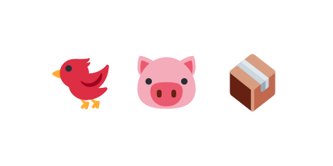

# 01 鳥・ブタ・箱を画像にする



ここまでゲームの中身は完成しています。ここからは見た目と音で仕上げます。この節では、鳥・ブタ・箱を
丸や四角から絵文字の画像に置き換えます。画像は `game/` の中に `assets/` フォルダを作って入れます。

画像は Twemoji（CC-BY 4.0）の絵文字です。下のボタンからダウンロードして、解凍してできた
`assets/` を `game/` の中に置いてください（このステップの完成例 ZIP にも同梱してあります）。

::assets[鳥・ブタ・箱の画像をダウンロード]

> **今回さわる `game/`:** `scenes/game-scene.js` を書き換え、`assets/` に画像を追加

## 画像を読み込む

`preload`（ゲーム開始前に画像を読み込む場所）を足します。

:::code[`GameScene` クラスの中（`create` の前に、メソッドとして追加）]{filepath=scenes/game-scene.js offset=6}

```js
  preload() {
    // 素材は twemoji の絵文字画像。
    this.load.image('bird', 'assets/1f426.png');
    this.load.image('pig', 'assets/1f437.png');
    this.load.image('block', 'assets/1f4e6.png');
  }
```

:::

- `preload()` … `create` の前に呼ばれ、画像や音を読み込むための場所です。
- `this.load.image('bird', 'assets/1f426.png')` … `'bird'` という名前で画像を読み込みます。以降この名前で使えます。

## 丸・四角を画像に置き換える

`this.add.circle(...)` を `this.add.image(...)` に置き換えます。当たり判定（`shape`）は今までどおり
円や四角のままにして、見た目だけ画像にします。

箱を画像にします。

:::code[`create` の中、箱を積む `for` の中（書き換え）]{filepath=scenes/game-scene.js offset=38}

```js
const box = this.add
  .image(towerX, boxY, 'block')
  .setDisplaySize(boxSize, boxSize);
this.matter.add.gameObject(box, {
  shape: { type: 'rectangle', width: boxSize, height: boxSize },
  restitution: 0.1,
});
```

:::

ブタを画像にします。

:::code[`create` の中、ブタを置く `for` の中（書き換え）]{filepath=scenes/game-scene.js offset=54}

```js
const pig = this.add
  .image(pos.x, pos.y, 'pig')
  .setDisplaySize(pigRadius * 2, pigRadius * 2);
```

:::

鳥を画像にします。

:::code[`create` の中、`spawnBird` の中（書き換え）]{filepath=scenes/game-scene.js offset=114}

```js
bird = this.add
  .image(anchor.x, anchor.y, 'bird')
  .setDisplaySize(birdRadius * 2, birdRadius * 2);
```

:::

- `this.add.image(x, y, 'bird')` … 画像を置きます。名前は `preload` でつけた `'bird'` などです。
- `setDisplaySize(w, h)` … 画像の表示サイズを、これまでの丸・四角と同じ大きさに合わせます。
- 当たり判定は `shape` で今までどおり指定するので、見た目が画像でも動きは変わりません。

## 素材のライセンス

使う絵文字画像は [Twemoji](https://github.com/jdecked/twemoji)（グラフィックは CC-BY 4.0）です。
`assets/` に `CREDITS.txt` と `LICENSE.txt` を置いて、出どころとライセンスを明記しています。

## 動かす

丸や四角だったものが、鳥・ブタ・箱の絵になりました。ぐっとゲームらしくなります。
次の節で、効果音をつけます。

::preview[このステップの完成イメージ（実際に触って動かせます）]

::codeview{defaultFile="scenes/game-scene.js"}
