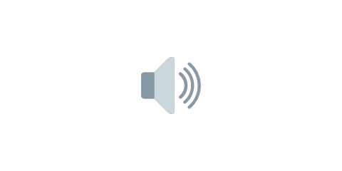

# 02 効果音を鳴らす



前の [01 鳥・ブタ・箱を画像にする](../01-image/LECTURE.md) で見た目が仕上がりました。この節では、
発射したときと、ブタに当たったときに効果音を鳴らします。

効果音は Kenney の Interface Sounds（CC0）です（`launch.wav` / `hit.wav`）。下のボタンから
ダウンロードして、解凍してできた `assets/` を `game/` の中に置いてください。

::assets[効果音つきの素材をダウンロード]

> **今回さわる `game/`:** `scenes/game-scene.js` を書き換え、`assets/` に効果音を追加

## 音を読み込む

効果音の読み込みを足します。

:::code[`preload` の中（画像の読み込みの後）]{filepath=scenes/game-scene.js offset=11}

```js
this.load.audio('launch', 'assets/launch.wav');
this.load.audio('hit', 'assets/hit.wav');
```

:::

- `this.load.audio('launch', 'assets/launch.wav')` … `'launch'` という名前で音を読み込みます。

## 発射したときに鳴らす

離して発射するときに、発射音を鳴らします。

:::code[`create` の中の `pointerup` ハンドラの中（`setVelocity` の後）]{filepath=scenes/game-scene.js offset=151}

```js
bird.setStatic(false);
bird.setVelocity(vx, vy);
this.sound.play('launch');
```

:::

- `this.sound.play('launch')` … 読み込んだ `'launch'` の音を1回鳴らします。

## 当たったときに鳴らす

ブタを消すときに、当たった音を鳴らします。

:::code[`update` の中の `for` の中（スコアを更新した後）]{filepath=scenes/game-scene.js offset=174}

```js
this.scoreText.setText('スコア: ' + this.score);
this.sound.play('hit');
```

:::

## 素材のライセンス

効果音は [Kenney](https://kenney.nl) の CC0（パブリックドメイン相当）素材です。`assets/` の
`CREDITS.txt` / `LICENSE.txt` に明記しています。CC0 なので表示義務はありませんが、感謝を込めて
クレジットに残しています。

## 動かす

鳥を発射すると音が鳴り、ブタに当たると別の音が鳴ります。手ごたえがぐっと増します。
次の節で、BGM（背景で流れる曲）を足します。

::preview[このステップの完成イメージ（実際に触って動かせます）]

::codeview{defaultFile="scenes/game-scene.js"}
